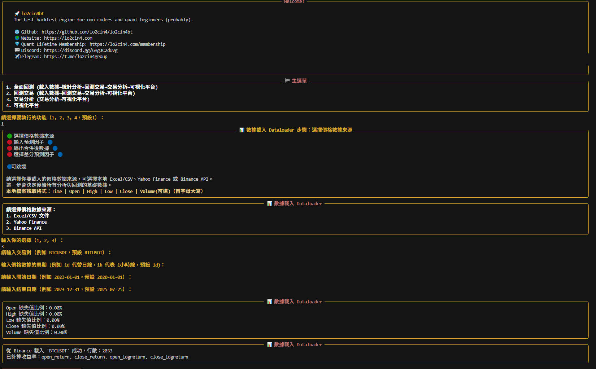

<!-- markdownlint-disable MD041 -->
<p align="center">
  
</p>
<!-- markdownlint-enable MD041 -->

# 🚀 Lo2cin4bt

**The best backtest engine for non-coders and quant beginners (probably).**

## 作者的話

大家好，我是 Jesse。

這個專案是一位「非程式背景」的交易員，透過 vibe coding 全程打造的交易回測框架。

我的目標是讓每一位量化新手，只需要以「說人話」的方式，便能輕鬆進行交易回測，並將結果可視化。

讓我們一同把那些仍然憑感覺的交易散戶淘汰吧！

在使用之前，可在 Github 專案的右上角給一個星😄

歡迎到群組提出任何意見。

- [TG討論社群](https://t.me/lo2cin4group)
- [DC討論社群](https://discord.com/invite/6HgJC2dUvg)

---

## ❓ 為什麼選擇 lo2cin4bt？

1. **全程無需寫程式**，只要在終端機選擇操作，加上大量提示，超適合新手
2. **三大核心**：統計分析、回測、可視化平台一次滿足
3. **大量中文註解**，輕鬆理解程式運作，方便二次開發
4. **高內聚低耦合設計**，易於修改擴展
5. **可離線運行**，數據安全
6. **支援任意因子、任意資產**，只要有數據就能回測

---

## 🔄 專案回測流程

lo2cin4bt 提供完整的量化回測流程，從數據載入到結果可視化，每個步驟都有明確的用途：

### 1. 📊 載入數據 (Data Loading)

- **用途**：建立回測的基礎數據
- **功能**：
  - 支援多種數據來源：本地 Excel/CSV、Yahoo Finance、Binance API、Coinbase API
  - 自動數據清洗與標準化
  - 預測因子載入與時間對齊
  - 數據驗證與缺失值處理

### 2. 🔬 統計分析 (Statistical Analysis)

- **用途**：深入分析數據特徵與預測因子有效性
- **功能**：
  - 數據分布檢驗與異常值檢測
  - 預測因子與價格的相關性分析
  - 時間序列穩定性測試
  - 季節性分析與自相關檢驗
  - 生成詳細的統計報告

### 3. 🧑‍💻 回測交易 (Backtesting)

- **用途**：模擬真實交易環境，測試策略有效性
- **功能**：
  - 多策略多參數組合向量化回測
  - 支援 MA、BOLL、NDayCycle 等技術指標
  - 自訂交易成本與滑點設定
  - 可導出的詳細交易記錄

### 4. 📈 交易分析 (Trade Analysis)

- **用途**：深入分析交易表現與策略優化
- **功能**：
  - 計算關鍵績效指標：Sharpe、Sortino、Max Drawdown
  - 交易統計分析：勝率、盈虧比、連續虧損
  - 與 Buy & Hold 策略比較
  - 風險調整後報酬率分析
  - 生成績效報告與圖表

### 5. 👁️ 可視化平台 (Visualization Platform)

- **用途**：直觀展示回測結果與策略表現
- **功能**：
  - 互動式權益曲線圖
  - 多策略比較與篩選
  - 參數敏感性分析
  - 績效指標視覺化
  - 即時數據探索與分析

---

## 💾 下載與安裝

1. 點選 GitHub 頁面右上角的「Code」→「Download ZIP」下載專案
2. 解壓縮 ZIP 檔案
3. 安裝 Python（建議 3.9 以上）
4. 開啟終端機（Terminal）或命令提示字元（CMD），切換到專案資料夾
5. 安裝依賴套件：

   ```bash
   pip install -r requirements.txt
   ```

6. 運行主程式：

   ```bash
   python main.py
   ```

7. 按照畫面指示選擇數據來源、回測參數，即可開始！

---

## 💾 下載與安裝 (完全編程新手懶人包)

1. 點選 GitHub 頁面右上角的「Code」→「Download ZIP」下載專案
2. 解壓縮 ZIP 檔案 lo2cin4bt，並將檔案移至你想放置的磁碟 / 資料夾
3. 複製目前 lo2cin4bt 的檔案路徑
4. 安裝 Cursor
5. 詢問它：「如何建立虛擬環境，並運行在 "檔案路徑" 的 lo2cin4bt？」
6. AI會指導你下載各種 Library 和 安裝環境

---

## 💻 推薦編程新手開發環境： Cursor

### 安裝 Cursor（AI 編輯器）

1. 前往 [Cursor 官方網站](https://www.cursor.cn/) 下載並安裝 Cursor。
2. 支援 AI 助理協作，可以自然語言解決安裝難題。

### 用 Cursor 開啟本專案

1. 開啟 Cursor。
2. 點選「File」→「Open Folder...」，選擇剛剛解壓縮的專案資料夾。
3. 建議在左側 EXPLORER 檢視所有檔案結構，右側可直接點擊 .py 檔案進行編輯。
4. 內建終端機（Terminal）：
   - 點選「Terminal」→「New Terminal」，即可在專案根目錄下執行 pip、python 等指令。

### 執行與除錯

- 在 Cursor 內直接按 F5 或點選「Run」→「Start Debugging」可進行除錯。
- 也可在內建終端機輸入 `python main.py` 直接執行。

---

## 📄 準備文件格式

### 1. 價格文件（非必須）

- 支援 Excel（.xlsx）、CSV
- 必要欄位：Time, Open, High, Low, Close
- **時間欄位名稱**：支援 `Time`、`Date`、`Timestamp`（系統會自動標準化為 `Time`）
- **日期格式**：建議使用 `DD/MM/YYYY` (如：31/12/2023) 或 `YYYY-MM-DD`（如：2023-01-01）
- 目前僅支援單一預測因子進行回測與差分，未來將開放多預測因子功能，敬請期待！
- 範例：

  | Time | Open | High | Low | Close |
  |------|------|------|-----|-------|
  | 2020-01-01 | 100 | 110 | 90 | 105 |

### 2. 預測因子文件（非必須）

- 支援 Excel（.xlsx）、CSV、JSON
- 必要欄位：Time 或 Date, [自訂因子欄位]
- **時間欄位名稱**：支援 `Time`、`Date`、`Timestamp` 等（系統會自動標準化為 `Time`）
- **日期格式**：支援多種格式，可在 autorunner 配置中指定：
  - `YYYY-MM-DD`（如：2023-01-01）→ 配置 `"time_format": "%Y-%m-%d"`
  - `DD/MM/YYYY`（如：01/01/2023）→ 配置 `"time_format": "%d/%m/%Y"`
  - `MM/DD/YYYY`（如：01/01/2023）→ 配置 `"time_format": "%m/%d/%Y"`
- 需放在`records\dataloader\import`，系統會自動檢測
- 範例：

  | Date | factor1 | factor2 |
  |------|---------|---------|
  | 2020-01-01 | 0.5 | 1.2 |

---

## 🧑‍💻 互動流程範例（Demo）

以下為一個典型的命令行互動流程範例：

<p align="center">
  
</p>

## 🗂️ 專案結構

```raw
lo2cin4bt/
├── main.py
├── autorunner/             # 自動化回測模組
├── backtester/             # 回測引擎模組
├── dataloader/             # 數據載入模組
├── metricstracker/         # 績效分析模組
├── plotter/                # 可視化模組
├── statanalyser/           # 統計分析模組
├── records/                # 數據與結果存放
│   └── autorunner/         # 自動化回測配置檔案
├── assets/                 # 靜態資源
├── requirements.txt
└── README.md
```

> 每個資料夾內都有對應的 README，遇到問題請先參考「疑難排解」區塊！

---

## 🚀 Autorunner 自動化回測模組 *NEW*

### 概述
Autorunner 是 lo2cin4bt 的自動化回測模組，讓用戶可以透過配置文件驅動整個回測流程，無需手動輸入參數。支援多種數據來源、多策略配置和批次執行。

### 核心特性
- **📝 配置文件驅動**：透過 JSON 配置文件定義所有回測參數
- **🔄 全自動執行**：數據載入 → 回測執行 → 績效分析一鍵完成
- **📊 多數據源支援**：Yahoo Finance、Binance、Coinbase、本地文件
- **⚡ 批次處理**：支援多個配置文件同時執行
- **🎯 零交互設計**：適合一次回測大量數據

### 快速開始

#### 1. 準備配置文件
將 `records/autorunner/config_template.json` 複製為您的配置文件，並根據需要修改：。

#### 2. 執行自動化回測
```bash
python main.py
# 在主選單選擇 "5. 🚀 Autorunner 自動化回測"
# 選擇您的配置文件
# 系統將自動執行完整回測流程
```

### 支援的數據來源

| 數據源 | 配置方式 | 說明 |
|--------|----------|------|
| **Yahoo Finance** | `"source": "yfinance"` | 支援全球股票、ETF、指數 |
| **Binance** | `"source": "binance"` | 支援加密貨幣交易對 |
| **Coinbase** | `"source": "coinbase"` | 支援加密貨幣交易對 |
| **本地文件** | `"source": "file"` | 支援 CSV/Excel 格式 |

### 批次執行
支援多個配置文件同時執行，適合策略優化和參數測試：

1. 在 `records/autorunner/` 目錄放置多個配置文件
2. 執行 autorunner 時選擇多個配置
3. 系統將依序執行所有選定配置的回測與分析，並放置在對應資料夾

---

## 📂 數據存放與輸出說明

- **預測因子檔案存放**：
  - 需存放於 `records/dataloader/import` 資料夾，格式為 `csv/xlsx/json` 檔案。
- **回測結果（交易紀錄）**：
  - 自動產生並存放於 `records/backtester/` 資料夾，格式為 `.parquet` 檔案。
  - 每次回測會產生一個唯一檔名（如 `20250723_97dpnzl6.parquet`）。
- **統計分析結果**：
  - 自動產生於存放於 `records/backtester/statanalyser` 資料夾，包含 `processed_data.csv`、`stats_report.txt` 等。
- **交易分析**：
  - 系統會自動讀取 `records/backtester/` 下的 parquet 檔案，計算後會產生新的 `.parquet` 檔案，並存放於`records/metricstracker/`內 。
- **可視化平台**：
  - 系統會會自動讀取 `records/metricstracker/` 下的 parquet 檔案，並以互動式圖表展示。
- **日誌檔案**：
  - 所有錯誤與執行日誌會存於 `logs/backtest_errors.log`。
- **自訂導出**：
  - 可於互動流程中選擇導出個別回測結果為 CSV。

---

## 🎯 開發目標與進度

### 目前已完成

<details>
<summary>📅 2025-10-08 </summary>

- 修正了各種 BUG
- 新增了更多 autorunner config 範例
- 系統目前可以閱讀 timestamp 格式的代碼了

</details>

<details>
<summary>📅 2025-10-03 </summary>

- 修改了 metricstracker 的儲存方式以降低電腦配置需求 
- 【重榜】省略輸入選項的全自動版本 Autorunner 已上線！
  - 在 records/autorunner 中設定 config.json
  - 運行 main.py，在主選單選擇 autorunner
  - 系統會自動回測並產生可視化所需要的檔案

</details>

<details>
<summary>📅 2025-09-14 </summary>

- 擴展了回測時的 default 功能為 defaultlong, defaultshort 和 defaultall。
  - 以均線交叉策略為例，defaultlong 能檢查「升穿均線做多、跌穿均線平倉」的部份；
  - defaultshort 能檢查「跌穿均線做空、升穿均線平倉」的部份；
  - defaultall 則會分別檢查以上兩者。

</details>

<details>
<summary>📅 2025-08-27 </summary>

- 修正了回測後程序無法讀取 Parquet file 的 Bug
- 【重構】DataLoader 模組大幅重構，引入 `AbstractDataLoader` 抽象基底類
  - 所有數據載入器（Binance、Coinbase、Yahoo Finance、File）現在繼承自統一基底類
  - 減少約 200+ 行重複程式碼
  - 統一的錯誤處理、成功訊息、警告顯示
  - 標準化的使用者輸入處理（日期、頻率、預設值）
  - 通用的數據處理方法（欄位標準化、型態轉換、缺失值處理）
  - 提升程式碼可維護性和擴展性

</details>

<details>
<summary>📅 2025-08-22 </summary>

- 【重榜】增加了 (高點、低點) HL、 (數值) VALUE 指標
- HL、VALUE 指標已加入 default 策略
- 【重榜】回測參數現在可以輸入單獨數值了，不用必須輸入區間
- 修正了持倉時間計算錯誤問題
- 修正了指標 MA9-MA12 輸入邏輯錯誤問題
- 修正了指標 NDAYS 計算錯誤問題
- 修改了策略參數設定時的文案，以更精簡直觀

</details>

<details>
<summary>📅 2025-08-19 </summary>

- 新增 Coinbase API 數據載入器 (感謝協作)
- 支援加密貨幣市場數據獲取（BTC、ETH 等交易對）
- 支援多種時間週期（1m、5m、15m、1h、6h、1d）

</details>

<details>
<summary>📅 2025-08-18 </summary>

- 【重榜】增加了 (百份位) Percentile 指標
- Percentile 指標已加入 default 策略

</details>

<details>
<summary>📅 2025-08-16 </summary>

- 【重榜】可視化平台增加了參數高原，檢測過擬合無難度
- BUG修正Calamar Ratio 的 Bug 已修正
- 反選功能指示更清晰

</details>

<details>
<summary>📅 2025-08-12</summary>

- 可視化平台增加了反選功能

</details>

<details>
<summary>📅 2025-08-04 </summary>

- 【重榜】向量化形式重構回測部份
- 動態檢測電腦配置以確保程式不會崩潰

</details>

<details>
<summary>📅 2025-07-23 (公佈日) </summary>

- 三大量化核心：統計分析、回測、可視化平台
- 支援多種數據來源（本地、Yahoo、Binance、Coinbase）
- 多策略多參數組合批量回測
- 詳細績效指標與互動式 Dash 可視化
- 完善的錯誤提示與日誌

</details>

### 未來開發目標

- Pre-commit 格式修改
- 穩健性測試 ( Walk-forward analysis )
- 策略逐筆賺賠分佈
- 新增技術指標指導文檔
- 自動判斷參數高原的合格參數區間
- 多個預測因子在單一策略進行回測
- 更多數據接口
- 接駁 AI

> 歡迎任何 issue、建議或貢獻，一起讓 lo2cin4bt 變得更好！

---

## 🤝 貢獻方式

歡迎任何 issue、PR、建議！
如有想法請直接開 issue 或 fork 專案。

### 開發環境設置

#### Pre-commit Hooks

本專案使用 pre-commit hooks 來確保程式碼品質。請在開發前安裝：

```bash
# 安裝 pre-commit
pip install pre-commit

# 安裝 git hooks
pre-commit install

# 手動執行所有檢查
pre-commit run --all-files
```

Pre-commit 會自動執行以下檢查：

- **程式碼格式化**: black, isort, autoflake
- **程式碼檢查**: flake8, pylint
- **型別檢查**: mypy
- **一般檢查**: 移除尾隨空白、修正檔案結尾等

### 程式碼規範

提交程式碼前請確保：

1. 所有 pre-commit hooks 檢查通過
2. 新增的函數包含型別提示
3. 遵循既有的命名慣例（如檔案名稱使用 PascalCase）
4. 保持中文註解風格，方便新手理解

---

⚠️ **免責聲明**

**本工具僅作為教學用途，並非投資建議，不構成任何要約、要約邀請或推薦任何投資產品。**

⚠️ **Disclaimer**

**This tool is for educational purposes only. It does not constitute investment advice, an offer, or a solicitation to
buy or sell any investment product.**

---

## 📜 授權聲明

本專案所有原始碼、文件、數據，允許學術、個人、非商業及商業用途。
但如需商業授權（包括但不限於銷售、SaaS、商業顧問等），請聯絡作者 lo2cin4_Jesse 取得授權。
任何分發、修改、再利用，必須保留原作者署名（lo2cin4_Jesse）及本授權條款。

---

## 📬 聯絡方式或商務合作

- Email: <lo2cin4@gmail.com>
- Telegram: [@lo2cin4_jesse](https://t.me/lo2cin4_jesse)

---

## 🙏 鳴謝

本專案部分可視化設計與互動靈感來自 [plotguy](https://pypi.org/project/plotguy/) 開源庫，特此致謝！

特別感謝 [@LouisChanCLY](https://github.com/LouisChanCLY) 對本專案的寶貴貢獻與支持！

---
