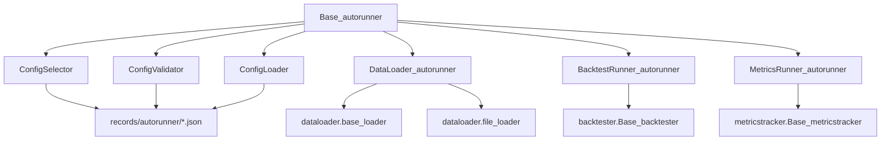
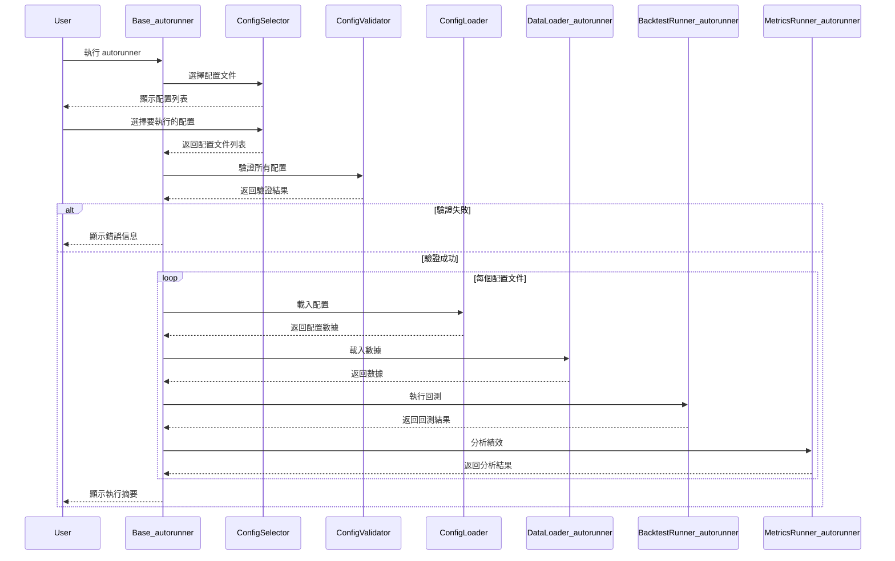
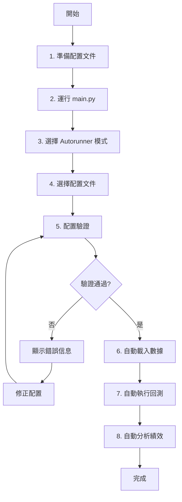

# autorunner 開發者說明文件

## 模組概覽

**autorunner** 是 Lo2cin4BT 量化回測框架的自動化執行模組，負責透過配置文件驅動完整的回測流程。本模組消除用戶互動需求，實現批次回測、多配置執行、結果自動記錄等功能，適合大規模策略測試與參數優化。

### 主要功能

- **配置文件驅動**：透過 JSON 配置文件定義完整的回測流程，無需編寫代碼
- **多配置批次執行**：支援選擇多個配置文件依序執行，適合批次測試
- **直接調用原版模組**：調用 dataloader、backtester、metricstracker 等原版模組，避免重複實現
- **配置驗證系統**：自動驗證配置文件完整性與正確性，提供詳細錯誤信息
- **全自動執行**：無需用戶互動，適合定時任務或批次處理
- **統一錯誤處理**：使用 Rich Panel 顯示錯誤信息，提供清晰的診斷建議

### 輸入與輸出

**輸入來源：**
- JSON 配置文件（位於 `records/autorunner/`）
- 配置模板（位於 `autorunner/templates/`）
- 數據文件（透過配置指定）

**輸出目標：**
- 回測交易記錄（Parquet/CSV，位於 `records/backtester/`）
- 績效分析結果（Parquet/Excel，位於 `records/metricstracker/`）
- 執行日誌（console 輸出）

---

## 專案結構

```plaintext
autorunner/
├── __init__.py
├── Base_autorunner.py                # 主控制器與流程協調
├── ConfigSelector_autorunner.py      # 配置文件選擇器
├── ConfigValidator_autorunner.py     # 配置文件驗證器
├── ConfigLoader_autorunner.py        # 配置文件載入器
├── DataLoader_autorunner.py          # 數據載入封裝器
├── BacktestRunner_autorunner.py      # 回測執行封裝器
├── MetricsRunner_autorunner.py       # 績效分析封裝器
├── SwitchDataSource_autorunner.py    # 快速切換數據源工具
├── DEV_PLAN.md                       # 開發計劃文件
├── templates/                        # 配置模板目錄
└── README.md                         # 本文件
```

- **Base_autorunner.py**：主控制器，協調配置選擇、驗證、載入、數據載入、回測執行、績效分析
- **ConfigSelector_autorunner.py**：掃描並選擇配置文件，支援單選或多選
- **ConfigValidator_autorunner.py**：驗證配置文件結構、必要欄位、數據類型
- **ConfigLoader_autorunner.py**：載入 JSON 配置文件，處理編碼問題
- **DataLoader_autorunner.py**：封裝原版 dataloader，將配置轉換為參數
- **BacktestRunner_autorunner.py**：封裝原版 backtester，處理指標參數轉換
- **MetricsRunner_autorunner.py**：封裝原版 metricstracker，自動化績效分析
- **SwitchDataSource_autorunner.py**：快速切換配置文件中的數據源

---

## 核心模組說明

### 1. Base_autorunner.py - 主控制器

**功能**：協調整個自動化回測流程，負責調用各子模組並處理執行流程

**主要方法：**
- `run()` - 執行單個配置文件的完整回測流程
- `run_batch()` - 執行多個配置文件的批次回測
- `_run_single_config(config_path)` - 執行單個配置文件
- `_display_execution_summary()` - 顯示執行摘要

**執行流程：**
1. 選擇配置文件（單個或多個）
2. 驗證所有配置文件
3. 依序執行每個配置：
   - 載入配置
   - 載入數據
   - 執行回測
   - 分析績效
4. 顯示執行摘要

**輸入**：無（透過互動選擇配置文件）或配置文件路徑列表
**輸出**：執行結果摘要

---

### 2. ConfigSelector_autorunner.py - 配置文件選擇器

**功能**：掃描並選擇要執行的配置文件

**主要方法：**
- `select_configs()` - 互動式選擇配置文件
- `_scan_config_files()` - 掃描 `records/autorunner/` 目錄
- `_display_config_list(files)` - 使用 Rich Table 顯示配置文件列表
- `_get_user_selection()` - 獲取用戶選擇（支援單選或多選）

**支援功能：**
- 自動掃描 `records/autorunner/*.json` 文件
- 排除模板文件（`*template*.json`）
- 支援選擇「全部」或特定文件
- 使用 Rich Table 美化顯示

**輸入**：無
**輸出**：選定的配置文件路徑列表

---

### 3. ConfigValidator_autorunner.py - 配置驗證器

**功能**：驗證配置文件的完整性和正確性

**主要方法：**
- `validate_config(config)` - 驗證單個配置文件
- `validate_batch(config_paths)` - 批次驗證多個配置文件
- `_validate_dataloader_config(config)` - 驗證數據載入配置
- `_validate_backtester_config(config)` - 驗證回測配置
- `_validate_metricstracker_config(config)` - 驗證績效分析配置

**驗證項目：**
- 必要欄位存在性（dataloader、backtester、metricstracker）
- 數據類型正確性（字符串、數值、布林值等）
- 參數範圍合理性（日期格式、數值範圍等）
- 文件路徑有效性（預測因子文件是否存在）
- 指標參數格式正確性（範圍格式、策略配對等）

**輸入**：配置字典或配置文件路徑
**輸出**：驗證結果（成功/失敗 + 錯誤信息）

---

### 4. ConfigLoader_autorunner.py - 配置載入器

**功能**：載入 JSON 配置文件，處理編碼問題

**主要方法：**
- `load_config(config_path)` - 載入單個配置文件
- `_read_json_file(file_path)` - 讀取 JSON 文件（處理編碼）

**特點：**
- 自動處理 UTF-8 編碼
- 捕獲 JSON 格式錯誤
- 使用 Rich Panel 顯示錯誤信息
- 支援註釋欄位（`_help`、`_comment` 等）

**輸入**：配置文件路徑
**輸出**：配置字典

---

### 5. DataLoader_autorunner.py - 數據載入封裝器

**功能**：封裝原版 dataloader 模組，將配置轉換為數據載入參數

**主要方法：**
- `load_data(config)` - 根據配置載入數據
- `_load_predictor_data(config)` - 載入預測因子數據
- `_calculate_returns(config)` - 計算收益率
- `_process_difference(config)` - 處理差分
- `get_loading_summary()` - 獲取載入摘要

**支援功能：**
- **直接調用原版方法**：使用 `FileLoader.detect_and_convert_timestamp()` 等原版方法
- **自動檢測 timestamp 格式**：支援秒級和毫秒級 Unix timestamp 自動轉換
- **多數據源支援**：Yahoo Finance、Binance、Coinbase、本地文件
- **預測因子處理**：自動對齊時間序列，支援差分處理
- **時間欄位智能識別**：自動識別 time、date、timestamp、datetime、period 等欄位（不區分大小寫）

**設計原則：**
- 不重複實現原版 dataloader 已有的功能
- 直接調用原版方法（如 `detect_and_convert_timestamp`）
- 只負責配置轉換和參數傳遞

**配置範例：**
```json
{
  "dataloader": {
    "source": "binance",
    "start_date": "2020-01-01",
    "binance_config": {
      "symbol": "BTCUSDT",
      "interval": "1d"
    },
    "predictor_config": {
      "predictor_path": "records/dataloader/import/predictor.csv",
      "predictor_column": "aggregated",
      "time_column": "timestamp",
      "time_format": ""  // ⚠️ 留空讓系統自動檢測 timestamp
    }
  }
}
```

**輸入**：配置字典
**輸出**：標準化的 DataFrame + 頻率字串

---

### 6. BacktestRunner_autorunner.py - 回測執行封裝器

**功能**：封裝原版 backtester 模組，將配置轉換為回測參數

**主要方法：**
- `run_backtest(data, config)` - 執行回測
- `_convert_indicator_params(config)` - 轉換指標參數
- `_prepare_backtest_config_for_engine(config)` - 準備回測配置

**支援功能：**
- 自動轉換指標參數格式（從配置字典到 `IndicatorParams` 物件）
- 支援多種指標：MA（12種）、BOLL（4種）、HL（6種）、PERC（4種）、NDAY（2種）、VALUE（1種）
- 自動補齊參數範圍（單一數值自動轉為範圍格式）
- 支援多策略配對組合
- 自動化執行（無需用戶確認）

**配置範例：**
```json
{
  "backtester": {
    "selected_predictor": "X",
    "condition_pairs": [
      {"entry": ["MA1"], "exit": ["MA4"]}
    ],
    "indicator_params": {
      "MA1_strategy_1": {
        "ma_type": "SMA",
        "ma_range": "10:100:10"
      },
      "MA4_strategy_1": {
        "ma_type": "SMA",
        "ma_range": "20:200:20"
      }
    },
    "trading_params": {
      "transaction_cost": 0.001,
      "slippage": 0.0005,
      "trade_delay": 1,
      "trade_price": "open"
    }
  }
}
```

**輸入**：數據 DataFrame + 配置字典
**輸出**：回測結果列表

---

### 7. MetricsRunner_autorunner.py - 績效分析封裝器

**功能**：封裝原版 metricstracker 模組，自動化績效分析

**主要方法：**
- `run_metrics(config)` - 執行績效分析
- `_select_parquet_files(mode)` - 選擇要分析的 Parquet 文件
- `_process_single_parquet(file_path, config)` - 處理單個 Parquet 文件

**支援功能：**
- 自動選擇最新的 Parquet 文件（auto 模式）
- 批次處理所有 Parquet 文件（all 模式）
- 自動計算績效指標（Sharpe、Sortino、Max Drawdown 等）
- 自動導出分析結果

**配置範例：**
```json
{
  "metricstracker": {
    "enable_metrics_analysis": true,
    "risk_free_rate": 0.04,
    "time_unit": 365,
    "file_selection_mode": "auto"
  }
}
```

**輸入**：配置字典
**輸出**：績效分析結果

---

### 8. SwitchDataSource_autorunner.py - 數據源切換工具

**功能**：快速修改配置文件中的數據源設定

**主要方法：**
- `switch_data_source(config_path, new_source)` - 切換數據源
- `_update_config_source(config, source)` - 更新配置中的數據源

**支援的數據源：**
- `yfinance` - Yahoo Finance API
- `binance` - Binance API
- `coinbase` - Coinbase API
- `file` - 本地文件

**使用範例：**
```python
from autorunner.SwitchDataSource_autorunner import switch_data_source

# 將配置文件的數據源切換為 Binance
switch_data_source("records/autorunner/my_config.json", "binance")
```

---

## 設計原則與架構

### 核心設計原則

1. **直接調用原版模組**：不重複實現功能，只負責配置轉換和參數傳遞
2. **統一 UI 樣式**：使用與原版相同的 Rich Panel 樣式（紅色標題 `#8f1511`，黃色邊框 `#dbac30`）
3. **無用戶互動**：完全自動化執行，適合批次處理
4. **完善錯誤處理**：提供詳細的錯誤診斷和修復建議
5. **向後兼容**：配置格式保持穩定，支援舊版配置

### 模組依賴關係



### 數據流設計



---

## 配置文件說明

### 配置文件結構

完整的配置文件包含三個主要區塊：

```json
{
  "_version": "1.0.0",
  "_description": "配置文件描述",
  "dataloader": {
    // 數據載入配置
  },
  "backtester": {
    // 回測執行配置
  },
  "metricstracker": {
    // 績效分析配置
  }
}
```

### 1. 數據載入配置 (dataloader)

#### 通用配置

```json
"dataloader": {
  "source": "binance",           // 數據來源：yfinance | binance | coinbase | file
  "frequency": "1d",              // 數據頻率：1m, 5m, 15m, 1h, 4h, 1d 等
  "start_date": "2020-01-01",     // 開始日期 (YYYY-MM-DD)
  "handle_missing_values": "fill",
  "missing_value_strategy": "A"   // A=前向填充, B,N=前N期均值, C,x=固定值
}
```

#### Yahoo Finance 配置

```json
"yfinance_config": {
  "symbol": "AAPL",      // 股票代碼
  "period": "1y",        // 時間範圍
  "interval": "1d"       // 數據間隔
}
```

#### Binance 配置

```json
"binance_config": {
  "symbol": "BTCUSDT",   // 交易對
  "interval": "1d"       // K線間隔
}
```

#### 本地文件配置

```json
"file_config": {
  "file_path": "records/dataloader/import/data.csv",
  "time_column": "time",
  "time_format": "%Y-%m-%d %H:%M:%S",  // 或留空自動推斷
  "open_column": "open",
  "high_column": "high",
  "low_column": "low",
  "close_column": "close"
}
```

#### 預測因子配置

```json
"predictor_config": {
  "predictor_path": "records/dataloader/import/predictor.csv",
  "predictor_column": "aggregated",
  "skip_predictor": false,
  "time_column": "timestamp",
  "time_format": ""  // ⚠️ 如果是 Unix timestamp（純數字），請留空！
}
```

**重要提示：Timestamp 格式處理**

- **Unix timestamp（純數字）**：`"time_format": ""` 留空，系統會自動檢測並轉換
  - 支援秒級（10位數，如 1609459200）
  - 支援毫秒級（13位數，如 1609459200500）
- **字符串日期格式**：需指定格式，如 `"%Y-%m-%d"` 或 `"%d/%m/%Y %H:%M:%S"`

### 2. 回測配置 (backtester)

#### 基本配置

```json
"backtester": {
  "selected_predictor": "X",     // 預測因子欄位名稱
  "initial_capital": 1000000     // 初始資金
}
```

#### 策略條件配對

```json
"condition_pairs": [
  {
    "entry": ["MA1"],          // 開倉條件
    "exit": ["MA4"]            // 平倉條件
  },
  {
    "entry": ["MA1", "MA9"],   // 多條件開倉
    "exit": ["MA4"]
  },
  {
    "entry": ["BOLL1"],
    "exit": ["BOLL4"]
  }
]
```

#### 指標參數配置

**移動平均指標 (MA1-MA12)：**
```json
"MA1_strategy_1": {
  "ma_type": "SMA",          // SMA, EMA, WMA
  "ma_range": "10:100:10"    // 起始:結束:步長
}
```

**布林帶指標 (BOLL1-BOLL4)：**
```json
"BOLL1_strategy_1": {
  "ma_range": "10:100:10",
  "sd_multi": "1,1.5,2"      // 標準差倍數（逗號分隔）
}
```

**高低點指標 (HL1-HL6)：**
```json
"HL1_strategy_1": {
  "n_range": "1:5:1",
  "m_range": "10:100:10"
}
```

**百分位指標 (PERC1-PERC4)：**
```json
"PERC1_strategy_1": {
  "window_range": "10:100:10",
  "percentile_range": "90:100:5"
}
```

**N日週期指標 (NDAY1-NDAY2)：**
```json
"NDAY1_strategy_1": {
  "nday_value": "5"          // N日數值
}
```

**數值指標 (VALUE1)：**
```json
"VALUE1_strategy_1": {
  "threshold": "0"           // 閾值
}
```

#### 交易參數配置

```json
"trading_params": {
  "transaction_cost": 0.001,   // 交易成本（手續費）
  "slippage": 0.0005,         // 滑點
  "trade_delay": 1,           // 交易延遲：0=當根, 1=下一根
  "trade_price": "open"       // 成交價格：open / close
}
```

### 3. 績效分析配置 (metricstracker)

```json
"metricstracker": {
  "enable_metrics_analysis": true,  // 是否啟用績效分析
  "risk_free_rate": 0.04,          // 無風險利率（0.04 = 4%）
  "time_unit": 365,                // 年化單位：日線股票252, 日線幣365
  "file_selection_mode": "auto",   // auto=最新一個, all=全部
  "export_format": "excel"         // csv, excel, json
}
```

---

## 使用流程與範例

### 使用流程圖



### 範例 1：單個配置文件執行

**步驟 1：準備配置文件**

創建或修改 `records/autorunner/my_strategy.json`：
```json
{
  "_version": "1.0.0",
  "_description": "我的 BTC 回測策略",
  "dataloader": {
    "source": "binance",
    "binance_config": {
      "symbol": "BTCUSDT",
      "interval": "1d"
    },
    "start_date": "2020-01-01",
    "predictor_config": {
      "skip_predictor": true
    }
  },
  "backtester": {
    "selected_predictor": "X",
    "condition_pairs": [
      {"entry": ["MA1"], "exit": ["MA4"]}
    ],
    "indicator_params": {
      "MA1_strategy_1": {"ma_type": "SMA", "ma_range": "10:50:10"},
      "MA4_strategy_1": {"ma_type": "SMA", "ma_range": "20:100:20"}
    }
  }
}
```

**步驟 2：運行 autorunner**
```python
python main.py
# 選擇 "3" - Autorunner 自動化回測
# 選擇配置文件編號
```

**步驟 3：查看結果**
- 回測記錄：`records/backtester/`
- 績效分析：`records/metricstracker/`

---

### 範例 2：批次執行多個配置

**場景**：測試不同數據源的相同策略

準備三個配置文件：
- `strategy_btc.json` - 使用 Binance BTC 數據
- `strategy_eth.json` - 使用 Binance ETH 數據
- `strategy_aapl.json` - 使用 Yahoo Finance AAPL 數據

運行 autorunner 並選擇「全部」，系統會依序執行所有配置。

---

### 範例 3：使用 Timestamp 預測因子

**場景**：使用包含 Unix timestamp 的預測因子數據

配置文件：
```json
{
  "dataloader": {
    "source": "binance",
    "binance_config": {
      "symbol": "BTCUSDT",
      "interval": "1d"
    },
    "predictor_config": {
      "predictor_path": "records/dataloader/import/crypto_metrics.csv",
      "predictor_column": "aggregated",
      "time_column": "timestamp",
      "time_format": ""  // ⚠️ 重要：留空讓系統自動檢測 timestamp！
    }
  }
}
```

**系統會自動：**
1. 檢測到 timestamp 欄位是數值型態
2. 判斷是秒級（10位數）或毫秒級（13位數）
3. 自動轉換為 datetime 格式
4. 與價格數據對齊合併

**顯示範例：**
```
╭──────── 📊 數據載入 Dataloader ────────╮
│ 檢測到秒級timestamp格式，正在轉換...   │
╰────────────────────────────────────────╯

╭──────── 📊 數據載入 Dataloader ────────╮
│ timestamp轉換成功，格式為：2019-12-31  │
╰────────────────────────────────────────╯
```

---

## 技術細節

### 依賴套件

- **pandas**：數據處理
- **numpy**：數值計算
- **rich**：終端 UI 美化
- **json**：配置文件讀寫
- **logging**：日誌記錄
- **原版模組**：dataloader、backtester、metricstracker

### 配置文件規範

**檔案位置**：`records/autorunner/*.json`

**命名規範**：
- 模板文件：包含 `template` 字樣（會被選擇器忽略）
- 實際配置：任意有意義的名稱（如 `btc_ma_strategy.json`）

**編碼要求**：
- 必須使用 UTF-8 編碼
- 不支援 BOM（Byte Order Mark）
- JSON 格式必須正確（使用 JSON validator 檢查）

**註釋欄位**：
- `_version`：配置文件版本
- `_description`：配置文件描述
- `_help`：欄位說明（不影響執行）
- `_comment`：註釋（不影響執行）

### 參數轉換邏輯

#### 單一數值轉範圍格式

配置中可以使用單一數值，系統會自動轉換：

```json
// 配置文件中寫：
"ma_range": "50"

// 自動轉換為：
"ma_range": "50:50:1"
```

#### 指標參數映射

從配置字典轉換為 `IndicatorParams` 物件：

```python
# 配置
{
  "MA1_strategy_1": {"ma_type": "SMA", "ma_range": "10:50:10"}
}

# 轉換為
IndicatorParams(
  indicator_name="MA1",
  strategy_id=1,
  params={"ma_type": "SMA", "ma_range": "10:50:10"}
)
```

### Timestamp 自動轉換機制

autorunner 調用原版 dataloader 的 `detect_and_convert_timestamp()` 方法：

**檢測邏輯：**
1. 檢查 Time 欄位是否為數值型態
2. 檢查數值是否為 numpy.int64、numpy.float64 等類型（不只是 Python int/float）
3. 根據數值大小判斷：
   - `value > 1e10` → 毫秒級 timestamp
   - `value <= 1e10` → 秒級 timestamp
4. 使用 `pd.to_datetime(unit="s"或"ms")` 轉換

**避免重複轉換：**
- `predictor_loader._process_time_column()` 檢查已是 datetime 格式則跳過
- `validator_loader._handle_time_index()` 檢查已是 datetime 格式則跳過

---

## 維護與擴充指南

### 新增數據源支援

若要新增新的數據源（如 Kraken），需要：

1. 在原版 `dataloader` 模組中實現 `KrakenLoader`
2. 在 `DataLoader_autorunner.py` 中添加對應的載入邏輯
3. 在配置模板中添加 `kraken_config` 區塊
4. 更新本 README 的配置說明

**不要在 autorunner 中重複實現數據載入邏輯！**

### 新增指標支援

若要新增新的技術指標（如 RSI），需要：

1. 在原版 `backtester` 模組中實現指標類
2. 在 `BacktestRunner_autorunner.py` 的 `_convert_indicator_params()` 中添加參數轉換邏輯
3. 在配置模板中添加 RSI 參數範例
4. 更新本 README 的指標說明

### 修改 UI 樣式

autorunner 使用與原版相同的 UI 樣式，修改時需保持一致：

- 標題顏色：`#8f1511`（紅色）
- 邊框顏色：`#dbac30`（黃色）
- 標題格式：`[bold #8f1511]📊 數據載入 Dataloader[/bold #8f1511]`

若需修改樣式，應該在原版模組中修改，autorunner 會自動繼承。

### 常見維護事項

**配置格式變更：**
- 更新 `config_template.json`
- 更新 `ConfigValidator` 的驗證邏輯
- 更新本 README 的配置說明

**原版模組介面變更：**
- 檢查 autorunner 的調用邏輯是否需要更新
- 確保參數轉換邏輯仍然正確
- 運行完整測試確認兼容性

**新增配置選項：**
- 在對應的 Runner 類中添加處理邏輯
- 更新配置模板和驗證器
- 添加使用範例到本 README

---

## 疑難排解

### 1. 配置文件載入失敗 09/10/2025

**問題詳情：** 選擇配置文件後顯示「JSON 格式錯誤」或「編碼錯誤」

**可能原因：**
- JSON 格式不正確（缺少逗號、括號不匹配等）
- 文件編碼不是 UTF-8
- 文件包含 BOM（Byte Order Mark）

**解決方法：**
- 使用 JSON validator 檢查格式（如 [jsonlint.com](https://jsonlint.com/)）
- 確認文件編碼為 UTF-8（不含 BOM）
- 檢查是否有中文引號（""）應改為英文引號（""）
- 從 `templates/` 目錄複製模板重新編輯

---

### 2. 配置驗證失敗 09/10/2025

**問題詳情：** 配置文件驗證時顯示「缺少必要欄位」或「參數格式錯誤」

**可能原因：**
- 缺少必要的配置區塊（dataloader、backtester）
- 指標參數格式不正確
- 數據源配置不完整

**解決方法：**
- 對照 `config_template.json` 檢查是否缺少必要欄位
- 確認指標參數使用範圍格式：`"10:100:10"`（起始:結束:步長）
- 確認選擇的數據源有對應的配置區塊（如選擇 binance 需要 binance_config）
- 檢查錯誤信息中指出的具體缺失欄位

---

### 3. Timestamp 無法正確轉換 09/10/2025

**問題詳情：** 預測因子包含 timestamp，但載入後時間範圍錯誤或無法與價格數據對齊

**可能原因：**
- `time_format` 設定錯誤（應該留空但填了格式）
- Timestamp 數值超出合理範圍
- Timestamp 被讀取為字符串而非數值

**解決方法：**
- **如果是 Unix timestamp（純數字）**：`"time_format": ""` 必須留空
- 確認 timestamp 範圍合理：
  - 秒級：約 10 位數（1000000000 ~ 2000000000）
  - 毫秒級：約 13 位數（1000000000000 ~ 2000000000000）
- 檢查 CSV 文件中 timestamp 欄位是否有引號包圍（應該沒有）
- 查看調試信息中的「檢測 timestamp」面板，確認數值類型

---

### 4. 數據載入後無法合併 09/10/2025

**問題詳情：** 顯示「價格數據與預測因子數據無時間交集，無法合併」

**可能原因：**
- 時間範圍沒有重疊
- 時間精度不同（價格精確到秒，預測因子只有日期）
- 時區問題

**解決方法：**
- 查看「時間對齊診斷」面板，對比兩邊的時間範圍
- 確認兩邊的時間範圍有重疊
- 如果精度不同，需要統一精度（都使用日期或都精確到秒）
- 檢查 timestamp 轉換是否成功（應該看到「timestamp轉換成功」提示）

---

### 5. 回測無交易或交易數量異常 09/10/2025

**問題詳情：** 回測完成但顯示「無交易」或交易數量與預期不符

**可能原因：**
- 指標參數範圍不合理（如 MA 週期過長）
- 策略條件配對錯誤
- 預測因子欄位名稱錯誤
- 數據質量問題（缺失值、異常值過多）

**解決方法：**
- 檢查指標參數範圍是否合理（MA 週期不應超過數據長度的1/3）
- 確認 `selected_predictor` 欄位名稱與數據中的欄位一致
- 檢查策略條件配對邏輯是否正確
- 先用較寬鬆的參數範圍測試（如 MA 10:50:10）
- 查看數據預覽，確認數據質量正常

---

### 6. 配置文件中有多個時間欄位 09/10/2025

**問題詳情：** CSV 文件包含多個時間相關欄位（如 `timestamp`、`timestamp.1`、`Time`），導致載入失敗

**可能原因：**
- CSV 文件匯出時產生重複欄位
- Excel 轉 CSV 時欄位名稱衝突

**解決方法：**
- 系統會自動選擇優先順序最高的欄位（timestamp > datetime > date > time > period）
- 自動排除帶有數字後綴的重複欄位（如 `timestamp.1`、`time_2`）
- 如果仍有問題，在 CSV 中手動刪除重複的時間欄位，只保留一個
- 在 `predictor_config` 中明確指定要使用的時間欄位：`"time_column": "timestamp"`

---

### 7. 績效分析失敗或結果不完整 09/10/2025

**問題詳情：** MetricsRunner 執行失敗或分析結果缺失某些指標

**可能原因：**
- Parquet 文件不存在或格式錯誤
- 回測記錄缺少必要欄位
- 無風險利率或時間單位設定錯誤

**解決方法：**
- 確認 `records/backtester/` 目錄下有 Parquet 文件
- 檢查 Parquet 文件是否完整（使用 `records/Read_parquet.py` 查看）
- 確認 `risk_free_rate` 格式正確（0.04 表示 4%）
- 確認 `time_unit` 設定正確（日線股票 252，日線幣 365）
- 查看 MetricsRunner 的錯誤信息，根據提示修正

---

### 8. 多配置執行時部分失敗 09/10/2025

**問題詳情：** 批次執行多個配置時，某些配置成功，某些失敗

**可能原因：**
- 某些配置文件格式有誤
- 某些數據源無法連接（如 API 限制）
- 資源不足（記憶體、磁碟空間）

**解決方法：**
- 查看執行摘要，找出失敗的配置文件
- 單獨運行失敗的配置，查看詳細錯誤信息
- 檢查網路連接（對於 API 數據源）
- 確認有足夠的磁碟空間儲存結果
- 考慮分批執行，減少同時處理的配置數量

---

### 9. 參數組合數量異常 09/10/2025

**問題詳情：** 顯示的參數組合數量與預期不符（如預期 16 個卻顯示 80 個）

**可能原因：**
- 指標參數轉換邏輯錯誤
- 策略配對複製錯誤
- 參數範圍解析錯誤

**解決方法：**
- 確認使用 `BacktestRunner_autorunner.py` 的 `_convert_indicator_params()` 方法
- 檢查每個指標的參數範圍格式是否正確
- 確認 `condition_pairs` 數量與預期一致
- 查看調試輸出中的「參數組合數量」信息
- 參考 DEV_PLAN.md 中的「參數組合數量異常問題」解決方案

---

## 與其他模組的關聯

### 上游依賴

- **main.py**：提供 autorunner 入口
- **配置文件**：定義執行參數

### 下游調用

- **dataloader**：數據載入與前處理
- **backtester**：回測執行與交易模擬
- **metricstracker**：績效指標計算

### 數據傳遞

```
配置文件 → ConfigLoader → Base_autorunner
                             ↓
                      DataLoader_autorunner → dataloader 模組
                             ↓
                      BacktestRunner_autorunner → backtester 模組
                             ↓
                      MetricsRunner_autorunner → metricstracker 模組
```

---

## 開發規範

### 代碼風格

- 遵循 PEP 8 規範
- 使用類型提示（Type Hints）
- 添加完整的 docstring
- 使用 Rich Panel 統一 UI 樣式

### 調試輸出

- 使用 Rich Panel 而非 print()
- 調試信息使用 `console.print()`
- 保持輸出格式一致
- 重要步驟添加調試輸出

### 錯誤處理

- 使用 try-except 捕獲所有可能的異常
- 提供詳細的錯誤信息和修復建議
- 使用 Rich Panel 顯示錯誤（紅色邊框 `#8f1511`）
- 不要讓程序直接崩潰，提供友善的錯誤提示

### 設計原則（重要！）

1. **不重複實現**：直接調用原版模組的方法，不自己寫新代碼
2. **只負責轉換**：配置參數 → 原版模組參數的轉換
3. **保持一致**：UI 樣式、錯誤處理與原版模組保持一致
4. **調用原版方法**：如 `self._loader_helper.detect_and_convert_timestamp()`

**範例：**
```python
# ❌ 錯誤：自己實現 timestamp 轉換
def _detect_and_convert_timestamp(self, data, time_col):
    # ... 100 行重複代碼 ...

# ✅ 正確：調用原版方法
from dataloader.file_loader import FileLoader
self._loader_helper = FileLoader()
self._loader_helper.detect_and_convert_timestamp(data, time_col)
```

---

## 參考資源

### 相關文件

- **DEV_PLAN.md** - 開發計劃與進度記錄
- **dataloader/README.md** - 數據載入模組說明
- **backtester/README.md** - 回測模組說明
- **metricstracker/README.md** - 績效分析模組說明
- **Development_Guideline.md** - 開發指南
- **README_CLI_STYLE.md** - CLI 樣式規範

### 配置模板

- `records/autorunner/config_template.json` - 完整配置模板
- `records/autorunner/config_template_single.json` - 簡化單策略模板
- `records/autorunner/config_template_5mdata.json` - 5分鐘數據模板
- `records/autorunner/config_template_single_timestamp.json` - Timestamp 處理範例

### 原版模組

- `dataloader/base_loader.py` - 數據載入基底類
- `backtester/Base_backtester.py` - 回測主控制器
- `metricstracker/Base_metricstracker.py` - 績效分析主控制器

---

