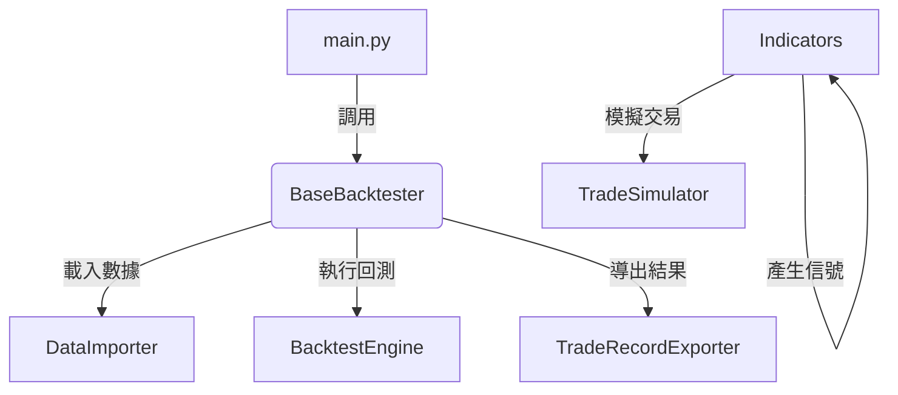

# backtester 開發者說明文件

## 模組概覽（Module Overview）

**backtester** 是 Lo2cin4BT 量化回測框架的核心回測模組，負責協調數據載入、用戶互動、回測執行、交易模擬、結果記錄與導出等全流程。  
本模組以高內聚、低耦合為設計原則，確保回測流程現代化、可維護、易於擴充。

- **輸入來源**：標準化行情與因子 DataFrame、用戶參數設定
- **輸出目標**：回測交易記錄（Parquet/CSV）、回測摘要、策略參數、元數據

---

## 開發目標（Development Goals）

- 提供標準化、可擴充的回測主流程協調器
- 支援多策略、多參數組合、批次回測
- 嚴格數據驗證、用戶互動與參數收集
- 統一交易記錄、結果導出與元數據管理
- 保持模組化、低耦合、易於單元測試與維護

---

## 專案結構（Project Structure）

```plaintext
backtester/
├── __init__.py
├── Base_backtester.py              # 回測主流程協調器、用戶互動與參數收集
├── DataImporter_backtester.py      # 數據載入與標準化
├── BacktestEngine_backtester.py    # 回測引擎（策略組合、信號產生）
├── Indicators_backtester.py        # 技術指標管理與信號產生
├── TradeSimulator_backtester.py    # 交易模擬與持倉管理
├── TradeRecorder_backtester.py     # 交易記錄與驗證
├── TradeRecordExporter_backtester.py # 結果導出與元數據管理
├── README.md                       # 本文件
```

- **Base_backtester.py**：主流程協調器，負責調用各子模組、用戶互動、參數收集、配置生成
- **DataImporter_backtester.py**：數據載入、標準化、欄位驗證
- **BacktestEngine_backtester.py**：批次回測、策略組合、信號產生
- **Indicators_backtester.py**：技術指標計算與信號管理
- **TradeSimulator_backtester.py**：交易模擬、持倉管理、收益計算
- **TradeRecorder_backtester.py**：交易記錄、驗證、欄位標準化
- **TradeRecordExporter_backtester.py**：結果導出、Parquet/CSV、元數據寫入

---

## 核心模組功能（Core Components）

### 1. Base_backtester.py
- **功能**：回測主流程協調器，統一調用數據載入、用戶互動、回測執行、結果導出
- **主要處理**：run() 主流程、_export_results() 結果摘要與導出
- **輸入**：DataFrame、頻率、用戶參數
- **輸出**：回測結果、交易記錄、元數據

### 2. DataImporter_backtester.py
- **功能**：數據載入、欄位標準化、頻率偵測
- **主要處理**：支援多種行情/因子來源，欄位驗證
- **輸入**：檔案路徑、DataFrame
- **輸出**：標準化 DataFrame、頻率

### 3.BacktestEngine_backtester.py
- **功能**：批次回測、策略組合、信號產生
- **主要處理**：多組參數、並行回測、信號生成
- **輸入**：DataFrame、配置
- **輸出**：回測結果 list

### 4. Indicators_backtester.py
- **功能**：技術指標計算、信號產生
- **主要處理**：多種指標、參數組合、信號標準化
- **輸入**：DataFrame、指標參數
- **輸出**：信號 DataFrame

### 5. TradeSimulator_backtester.py
- **功能**：交易模擬、持倉管理、收益計算
- **主要處理**：根據信號模擬開平倉、計算持倉、收益、風險
- **輸入**：信號 DataFrame
- **輸出**：交易記錄 DataFrame

### 6. TradeRecorder_backtester.py
- **功能**：交易記錄、驗證、欄位標準化
- **主要處理**：記錄每筆交易、驗證完整性、欄位標準化
- **輸入**：交易模擬結果
- **輸出**：標準化交易記錄

### 7. TradeRecordExporter_backtester.py
- **功能**：結果導出、Parquet/CSV、元數據寫入
- **主要處理**：合併多組回測結果、寫入 metadata、批次導出
- **輸入**：交易記錄、回測摘要
- **輸出**：Parquet/CSV 檔案、metadata

---

## 數據流與組件依賴（Data Flow & Dependencies）



- 主流程協調 → 數據載入 → 用戶互動 → 回測執行 → 信號產生 → 交易模擬 → 結果記錄 → 導出
- 各模組可獨立調用，亦可串聯為完整流程

---

## 主要類別與方法（Key Classes & Methods）

- `BaseBacktester`：主流程協調器，run()、_export_results()、
- `DataImporter`：數據載入與標準化
- `BacktestEngine`：批次回測、信號產生
- `Indicators`：技術指標管理
- `TradeSimulator`：交易模擬、持倉管理
- `TradeRecorder`：交易記錄、驗證
- `TradeRecordExporter`：結果導出、metadata 寫入

---

## 維護重點（Maintenance Notes）

- 新增/修改流程、欄位、參數顯示時，**務必同步更新 Base_backtester 及所有依賴子類**
- 所有互動式 input() 需有預設值與錯誤提示，避免 crash
- 欄位名稱、型態、時間格式需全模組統一（如 'Time', 'Open', 'Close' 等）
- 每次擴充功能、格式、驗證規則時，請同步更新本 README 與頂部註解
- 若有下游依賴（如 metricstracker、statanalyser），需同步檢查數據流與欄位對應

---

## 參數命名與傳遞設計原則

- **內部參數傳遞**（如 `__init__`、function 參數、`trading_params` dict 等）一律使用小寫（如 `transaction_cost`, `slippage`, `trade_delay`, `trade_price`）。
- **主表格與 metadata 導出時**，才將欄位名稱轉為首字母大寫（如 `Transaction_cost`, `Slippage_cost`, `Trade_delay`, `Trade_price`）。
- 這樣可避免 Python 關鍵字參數錯誤，並確保程式內部一致性，僅對外資料格式（如 Parquet/CSV/Meta）做欄位命名規範。

---

## 欄位命名規範

- 所有主表格欄位，第一個字母大寫，其餘小寫。
- 兩個字以上的欄位用 _ 連接（如 Position_size, Trade_action, Equity_value）。
- meta 欄位首字母大寫。
- 請全流程、所有模組、所有導出/驗證/分析皆遵循此規範。

---

## ⚠️ NDayCycle 平倉信號產生注意事項

- NDayCycle 只能作為平倉信號，不能作為開倉信號。
- NDayCycle 的 exit_signal 不能在 _generate_signals 內直接產生，必須在 BacktestEngine combine_signals 特殊處理：
  - _generate_signals 內遇到 NDayCycle 必須直接回傳全 0，不報錯。
  - combine_signals 後，若 exit_params 只有 NDayCycle，必須呼叫 NDayCycleIndicator.generate_exit_signal_from_entry(entry_signal, n, strat_idx) 產生 exit_signal。
- 若未依此設計，NDayCycle exit_signal 將無法正確產生，導致只有一筆交易或無法平倉。 

## ⚠️ IndicatorParams 參數型態注意事項

- 所有指標參數都會被包成 dict（{'value': x, 'type': y}），必須用 get_param('參數名') 取值，否則會拿到 dict 型態。
- NDayCycle 的 n 參數、strat_idx 參數，務必用 param.get_param('n')、param.get_param('strat_idx') 取值，否則會導致型態錯誤。
- 其他指標（如 MA、BOLL）也建議統一用 get_param 取值，避免未來擴充時出現同樣問題。 

---

## 可視化平台
可視化平台請參見 plotter/README.md

---

## 範例流程（Example Workflow）

```python
from backtester.Base_backtester import BaseBacktester

backtester = BaseBacktester()
results = backtester.run()  # 互動式選擇因子、參數、執行回測、導出結果
```

---

## 技術備註（Technical Notes）

- **欄位標準化**：所有行情、交易記錄欄位統一為 'Time', 'Open', 'High', 'Low', 'Close', 'Volume', 'holding_period', 'pctchange' 等
- **策略組合**：支援多入場/多平倉、參數組合自動生成
- **交易記錄**：完整記錄每筆開平倉、持倉期間、收益
- **元數據管理**：Parquet metadata 寫入 batch_metadata、策略參數、指標摘要
- **導出格式**：Parquet、CSV，統一輸出至 records/backtester 目錄
- **依賴套件**：pandas, numpy, pyarrow, tqdm, 其他
- 新增指標時，請特別注意 Base_backtester.py 內所有參數詢問 Panel（如 MA/BOLL/NDAY 範圍等）顯示時會自動將半形冒號 : 換成全形冒號 ：，避免 Windows 終端機將 :100: 等誤判為 emoji。用戶輸入後會自動轉回半形冒號再做驗證。請維護此規則以確保 CLI 美觀與一致性。

---

如需擴充新流程、策略、欄位或有特殊需求，請先參考本 README 並同步更新相關註解與文件。 

---

## 疑難排解（持續更新）

1. IndicatorParams 參數型態問題 22/07/2025
問題詳情：所有 add_param 參數都會被包成 dict（{'value': x, 'type': y}），若直接用 param.n 或 param['n'] 取值，會拿到 dict，導致 NDayCycle exit_signal 產生失敗，無法平倉。
解決方法：所有參數必須用 param.get_param('n') 取值，保證型態正確。已修正所有 NDayCycle、MA、BOLL 相關流程，README 也已提醒。

2. NDayCycle 平倉方向邏輯錯誤 22/07/2025
問題詳情：原本 NDayCycle exit_signal 產生時，strat_idx=1 只找 entry_signal==1，strat_idx=2 只找 entry_signal==-1，導致多單/空單平倉對應錯誤，永遠無法平倉。
解決方法：已修正為 strat_idx=1（空單平倉）找 entry_signal==-1，N天後 exit_signal=1；strat_idx=2（多單平倉）找 entry_signal==1，N天後 exit_signal=-1。

3. Base 參數型態傳遞問題 22/07/2025
問題詳情：Base 或參數收集流程有時會將 n 包成 dict 傳遞，導致下游型態錯誤。
解決方法：NDayCycle get_params 內強制 n=int(n)，保證後續流程型態正確。 
