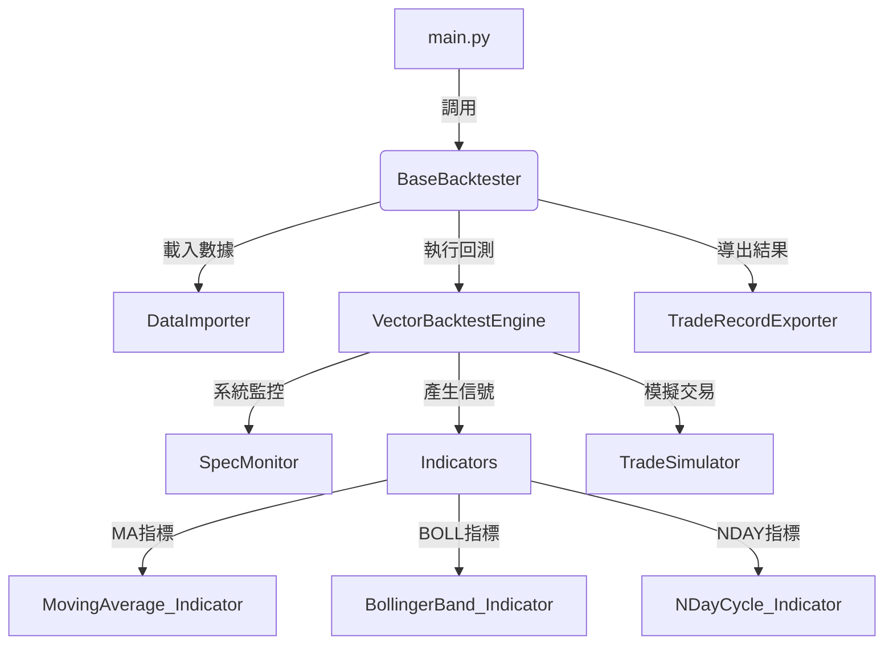

# backtester 開發者說明文件

## 模組概覽（Module Overview）

**backtester** 是 Lo2cin4BT 量化回測框架的核心回測模組，負責協調數據載入、用戶互動、回測執行、交易模擬、結果記錄與導出等全流程。
本模組以高內聚、低耦合為設計原則，確保回測流程現代化、可維護、易於擴充。

- **輸入來源**：標準化行情與因子 DataFrame、用戶參數設定
- **輸出目標**：回測交易記錄（Parquet/CSV）、回測摘要、策略參數、元數據

---

## 開發目標（Development Goals）

- 提供標準化、可擴充的回測主流程協調器
- 支援多策略、多參數組合、批次回測
- 嚴格數據驗證、用戶互動與參數收集
- 統一交易記錄、結果導出與元數據管理
- 保持模組化、低耦合、易於單元測試與維護
- 提供向量化回測引擎，大幅提升大規模參數組合的計算效率
- 整合系統資源監控，確保回測過程的穩定性與性能

---

## 專案結構（Project Structure）

```plaintext
backtester/
├── __init__.py
├── Base_backtester.py                    # 回測主流程協調器、用戶互動與參數收集
├── DataImporter_backtester.py           # 數據載入與標準化
├── VectorBacktestEngine_backtester.py   # 向量化回測引擎（策略組合、信號產生）
├── Indicators_backtester.py             # 技術指標管理與信號產生
├── MovingAverage_Indicator_backtester.py # 移動平均指標（MA1-MA12）
├── BollingerBand_Indicator_backtester.py # 布林通道指標（BOLL1-BOLL4）
├── NDayCycle_Indicator_backtester.py    # N日週期指標（NDAY1-NDAY2）
├── IndicatorParams_backtester.py        # 指標參數配置工具
├── TradeSimulator_backtester.py         # 交易模擬與持倉管理
├── TradeRecorder_backtester.py          # 交易記錄與驗證
├── TradeRecordExporter_backtester.py    # 結果導出與元數據管理
├── SpecMonitor_backtester.py            # 系統規格監控器
├── README.md                            # 本文件
```

- **Base_backtester.py**：主流程協調器，負責調用各子模組、用戶互動、參數收集、配置生成
- **DataImporter_backtester.py**：數據載入、標準化、欄位驗證、頻率檢測
- **VectorBacktestEngine_backtester.py**：向量化回測引擎、批次回測、策略組合、信號產生
- **Indicators_backtester.py**：技術指標計算與信號管理、指標註冊與調度
- **MovingAverage_Indicator_backtester.py**：移動平均指標，支援 MA1-MA12 十二種策略
- **BollingerBand_Indicator_backtester.py**：布林通道指標，支援 BOLL1-BOLL4 四種策略
- **NDayCycle_Indicator_backtester.py**：N日週期指標，支援 NDAY1-NDAY2 兩種策略
- **IndicatorParams_backtester.py**：統一參數容器、參數驗證、雜湊生成
- **TradeSimulator_backtester.py**：交易模擬、持倉管理、收益計算
- **TradeRecorder_backtester.py**：交易記錄、驗證、欄位標準化
- **TradeRecordExporter_backtester.py**：結果導出、Parquet/CSV、元數據寫入
- **SpecMonitor_backtester.py**：系統資源監控、CPU配置、記憶體管理

---

## 核心模組功能（Core Components）

### 1. Base_backtester.py

- **功能**：回測主流程協調器，統一調用數據載入、用戶互動、回測執行、結果導出
- **主要處理**：run() 主流程、get_user_config() 用戶配置收集、_export_results() 結果摘要與導出
- **特色功能**：Rich Panel 美化顯示、步驟跟蹤、參數驗證、多策略配置
- **輸入**：DataFrame、頻率、用戶參數
- **輸出**：回測結果、交易記錄、元數據

### 2. DataImporter_backtester.py

- **功能**：數據載入、欄位標準化、頻率偵測
- **主要處理**：支援多種行情/因子來源，欄位驗證，自動頻率檢測
- **特色功能**：整合 dataloader 模組、跨平台兼容、錯誤處理
- **輸入**：檔案路徑、DataFrame
- **輸出**：標準化 DataFrame、頻率

### 3. VectorBacktestEngine_backtester.py

- **功能**：向量化回測引擎、批次回測、策略組合、信號產生
- **主要處理**：多組參數、並行回測、信號生成、性能優化
- **特色功能**：Numba JIT 編譯優化、向量化批量計算、智能記憶體管理、進度監控
- **輸入**：DataFrame、配置
- **輸出**：回測結果 list

### 4. Indicators_backtester.py

- **功能**：技術指標計算、信號產生、指標管理
- **主要處理**：多種指標、參數組合、信號標準化、指標註冊
- **特色功能**：統一指標接口、向量化計算支援、Numba 優化
- **輸入**：DataFrame、指標參數
- **輸出**：信號 DataFrame

### 5. MovingAverage_Indicator_backtester.py

- **功能**：移動平均指標，支援多種均線型態與策略
- **主要處理**：MA1-MA12 十二種策略、SMA/EMA/WMA 均線型態
- **特色功能**：Numba 優化、向量化計算、智能緩存、統一計算邏輯
- **策略型態**：單均線（MA1-MA4）、雙均線（MA5-MA8）、多均線（MA9-MA12）

### 6. BollingerBand_Indicator_backtester.py

- **功能**：布林通道指標，支援多種突破策略
- **主要處理**：BOLL1-BOLL4 四種策略、通道寬度設定
- **特色功能**：Numba 優化、向量化計算、智能緩存、標準差計算優化
- **策略型態**：突破策略、回歸策略、通道寬度策略、綜合判斷策略

### 7. NDayCycle_Indicator_backtester.py

- **功能**：N日週期指標，支援順勢與反轉策略
- **主要處理**：NDAY1-NDAY2 兩種策略、平倉信號生成
- **特色功能**：Numba 優化、平倉信號自動生成、週期參數驗證
- **策略型態**：順勢策略（NDAY1）、反轉策略（NDAY2）

### 8. IndicatorParams_backtester.py

- **功能**：統一參數容器、參數驗證、雜湊生成
- **主要處理**：指標參數封裝、類型標註、緩存鍵生成
- **特色功能**：參數類型驗證、雜湊算法、交易參數管理
- **支援格式**：所有指標類型的參數封裝與驗證

### 9. TradeSimulator_backtester.py

- **功能**：交易模擬、持倉管理、收益計算
- **主要處理**：根據信號模擬開平倉、計算持倉、收益、風險
- **特色功能**：向量化交易模擬、統一接口、Numba 優化、智能持倉管理
- **輸入**：信號 DataFrame
- **輸出**：交易記錄 DataFrame

### 10. TradeRecorder_backtester.py

- **功能**：交易記錄、驗證、欄位標準化
- **主要處理**：記錄每筆交易、驗證完整性、欄位標準化
- **特色功能**：完整記錄結構、數據驗證、錯誤處理
- **輸入**：交易模擬結果
- **輸出**：標準化交易記錄

### 11. TradeRecordExporter_backtester.py

- **功能**：結果導出、Parquet/CSV、元數據寫入
- **主要處理**：合併多組回測結果、寫入 metadata、批次導出
- **特色功能**：智能摘要顯示、多格式導出、策略分析、分頁顯示
- **輸入**：交易記錄、回測摘要
- **輸出**：Parquet/CSV 檔案、metadata

### 12. SpecMonitor_backtester.py

- **功能**：系統規格監控器、資源管理、性能優化
- **主要處理**：CPU配置檢測、記憶體安全檢查、系統資源監控
- **特色功能**：跨平台兼容、智能配置建議、實時監控、性能優化
- **監控項目**：CPU核心數、記憶體使用量、並行處理閾值、系統配置

---

## 數據流與組件依賴（Data Flow & Dependencies）



- 主流程協調 → 數據載入 → 用戶互動 → 系統監控 → 回測執行 → 信號產生 → 交易模擬 → 結果記錄 → 導出
- 各模組可獨立調用，亦可串聯為完整流程

---

## 主要類別與方法（Key Classes & Methods）

- `BaseBacktester`：主流程協調器，run()、get_user_config()、_export_results()
- `DataImporter`：數據載入與標準化，load_and_standardize_data()
- `VectorBacktestEngine`：向量化回測引擎，run_backtests()、_true_vectorized_backtest()
- `IndicatorsBacktester`：技術指標管理，run_indicator()、calculate_signals()
- `MovingAverageIndicator`：移動平均指標，generate_signals()、vectorized_calculate_ma_signals()
- `BollingerBandIndicator`：布林通道指標，generate_signals()、vectorized_calculate_boll_signals()
- `NDayCycleIndicator`：N日週期指標，generate_signals()、generate_exit_signal_from_entry()
- `IndicatorParams`：參數容器，add_param()、get_param()、get_param_hash()
- `TradeSimulator_backtester`：交易模擬，simulate_trades()、simulate_trades_vectorized()
- `TradeRecorder_backtester`：交易記錄，record_trades()
- `TradeRecordExporter_backtester`：結果導出，export_to_parquet()、display_backtest_summary()
- `SpecMonitor`：系統監控，get_optimal_core_count()、check_memory_safety()

---

## 維護重點（Maintenance Notes）

- 新增/修改流程、欄位、參數顯示時，**務必同步更新 Base_backtester 及所有依賴子類**
- 所有互動式 input() 需有預設值與錯誤提示，避免 crash
- 欄位名稱、型態、時間格式需全模組統一（如 'Time', 'Open', 'Close' 等）
- 每次擴充功能、格式、驗證規則時，請同步更新本 README 與頂部註解
- 若有下游依賴（如 metricstracker、statanalyser），需同步檢查數據流與欄位對應
- **向量化計算邏輯需要與單個指標計算保持一致**
- **Numba 優化需要確保跨平台兼容性**
- **緩存機制需要正確管理記憶體使用**

---

## 參數命名與傳遞設計原則

- **內部參數傳遞**（如 `__init__`、function 參數、`trading_params` dict 等）一律使用小寫（如 `transaction_cost`, `slippage`, `trade_delay`, `trade_price`）。
- **主表格與 metadata 導出時**，才將欄位名稱轉為首字母大寫（如 `Transaction_cost`, `Slippage_cost`, `Trade_delay`, `Trade_price`）。
- 這樣可避免 Python 關鍵字參數錯誤，並確保程式內部一致性，僅對外資料格式（如 Parquet/CSV/Meta）做欄位命名規範。

---

## 欄位命名規範

- 所有主表格欄位，第一個字母大寫，其餘小寫。
- 兩個字以上的欄位用 _連接（如 Position_size, Trade_action, Equity_value）。
- meta 欄位首字母大寫。
- 請全流程、所有模組、所有導出/驗證/分析皆遵循此規範。

---

## ⚠️ IndicatorParams 參數型態注意事項

- 所有指標參數都會被包成 dict（{'value': x, 'type': y}），必須用 get_param('參數名') 取值，否則會拿到 dict 型態。
- NDayCycle 的 n 參數、strat_idx 參數，務必用 param.get_param('n')、param.get_param('strat_idx') 取值，否則會導致型態錯誤。
- 其他指標（如 MA、BOLL）也建議統一用 get_param 取值，避免未來擴充時出現同樣問題。

---

## 範例流程（Example Workflow）

```python
from backtester.Base_backtester import BaseBacktester

backtester = BaseBacktester()
results = backtester.run()  # 互動式選擇因子、參數、執行回測、導出結果
```

---

## 技術備註（Technical Notes）

- **欄位標準化**：所有行情、交易記錄欄位統一為 'Time', 'Open', 'High', 'Low', 'Close', 'Volume', 'holding_period', 'pctchange' 等
- **策略組合**：支援多入場/多平倉、參數組合自動生成
- **交易記錄**：完整記錄每筆開平倉、持倉期間、收益
- **元數據管理**：Parquet metadata 寫入 batch_metadata、策略參數、指標摘要
- **導出格式**：Parquet、CSV，統一輸出至 records/backtester 目錄
- **向量化優化**：Numba JIT 編譯、批量計算、智能緩存、並行處理
- **系統監控**：CPU配置檢測、記憶體安全檢查、性能優化建議
- **依賴套件**：pandas, numpy, pyarrow, tqdm, numba, rich, psutil
- 新增指標時，請特別注意 Base_backtester.py 內所有參數詢問 Panel（如 MA/BOLL/NDAY 範圍等）顯示時會自動將半形冒號 : 換成全形冒號 ：，避免 Windows 終端機將 :100: 等誤判為 emoji。用戶輸入後會自動轉回半形冒號再做驗證。請維護此規則以確保 CLI 美觀與一致性。

---

如需擴充新流程、策略、欄位或有特殊需求，請先參考本 README 並同步更新相關註解與文件。

---

## 疑難排解（持續更新）

1. IndicatorParams 參數型態問題 22/07/2025
問題詳情：所有 add_param 參數都會被包成 dict（{'value': x, 'type': y}），若直接用 param.n 或 param['n'] 取值，會拿到 dict，導致 NDayCycle exit_signal 產生失敗，無法平倉。
解決方法：所有參數必須用 param.get_param('n') 取值，保證型態正確。已修正所有 NDayCycle、MA、BOLL 相關流程，README 也已提醒。

2. Base 參數型態傳遞問題 22/07/2025
問題詳情：Base 或參數收集流程有時會將 n 包成 dict 傳遞，導致下游型態錯誤。
解決方法：NDayCycle get_params 內強制 n=int(n)，保證後續流程型態正確。

3. 向量化回測性能優化 02/08/2025
問題詳情：VectorBacktestEngine 執行速度慢，影響大量參數組合的回測效率。
解決方法：

- 添加 Numba JIT 編譯優化：所有核心計算函數使用 @njit(fastmath=True, cache=True)
- 實現真正的向量化批量計算：BollingerBand、MA 指標支援批量參數組合計算
- 優化批次處理策略：小任務數（≤1000）直接單進程處理，避免多進程開銷
- 添加全局緩存機制：避免重複計算相同參數組合的指標

4. 多策略維度衝突問題 04/08/2025 ✅ 已解決
問題詳情：當同時使用不同指標數量的策略時（如 MA1開倉+MA4平倉 與 MA1+MA9開倉+MA4平倉），會出現信號矩陣維度衝突，導致部分策略失效。具體表現為：

- 單獨測試 MA1開倉+MA4平倉：正常工作
- 單獨測試 MA1+MA9開倉+MA4平倉：可能無交易（邏輯衝突）
- 混合測試兩個策略：MA1開倉+MA4平倉策略完全失效

根本原因：VectorBacktestEngine 的向量化信號生成邏輯要求所有策略使用相同的指標數量維度，但不同策略的開倉/平倉指標數量不同，導致信號矩陣填充錯誤和緩存污染。

解決方法：實現分組處理策略

- 修改 `_generate_all_signals_vectorized` 函數，按指標數量分組策略
- 新增 `_group_strategies_by_indicator_count` 函數，按開倉/平倉指標數量分組
- 新增 `_process_strategy_group` 函數，處理單個策略分組
- 修改 `_simulate_all_trades_vectorized` 和 `_generate_all_results_simple` 函數，適配分組後的信號格式
- 修改 `_prepare_batch_data` 函數，處理分組後的結果

優點：

- 解決維度衝突問題，不同指標數量的策略可以同時運行
- 保持向量化處理的優勢，每個分組內部仍然使用向量化計算
- 緩存隔離，避免不同策略間的緩存污染
- 向後兼容，不影響現有的單策略回測功能
- 為未來優化提供基礎，可以進一步實現分組並行處理

6. 系統資源監控與優化 04/08/2025 ✅ 已實現
問題詳情：大規模參數組合回測時，系統資源使用不當可能導致記憶體溢出或性能下降。
解決方法：

- 新增 SpecMonitor 模組：提供系統資源檢測與監控
- 智能CPU配置：根據系統核心數自動優化並行處理參數
- 記憶體安全檢查：實時監控記憶體使用量，防止系統崩潰
- 跨平台兼容：支援 Windows、Linux、macOS 系統檢測
- 性能優化建議：根據系統配置提供最佳化建議

5. 回測結果狀態判斷邏輯不一致問題 19/12/2024 ✅ 已解決
問題詳情：VectorBacktestEngine 統計階段顯示成功回測數量與 TradeRecordExporter 顯示階段不一致。具體表現為：

- 統計階段：顯示 368 成功，0 失敗，48 無交易
- 顯示階段：查看成功結果顯示 0 個，查看失敗結果顯示全部失敗

根本原因：兩個模組使用不同的判斷邏輯來分類回測結果狀態：

- VectorBacktestEngine 使用正確的邏輯：Trade_action == 1 判斷是否有開倉交易
- TradeRecordExporter 使用錯誤的邏輯：把無交易的回測也歸類為失敗

解決方法：統一所有判斷邏輯為與 VectorBacktestEngine 完全一致的標準

- 成功：無錯誤且有實際開倉交易（Trade_action == 1 的數量 > 0）
- 失敗：有錯誤（error 不為 None）
- 無交易：沒有錯誤但沒有開倉交易（Trade_action == 1 的數量 == 0）

修正的文件和方法：

- TradeRecordExporter_backtester.py 中的 display_successful_results()
- TradeRecordExporter_backtester.py 中的 display_failed_results()
- TradeRecordExporter_backtester.py 中的 display_no_trade_results()
- TradeRecordExporter_backtester.py 中的 display_strategy_details()
- 按策略分組邏輯和 success_count 計算

優點：

- 統計階段與顯示階段完全一致，避免用戶困惑
- 正確區分成功、失敗、無交易三種狀態
- 為未來擴充提供統一的判斷標準
- 提升用戶體驗和系統可靠性

6. BOLL 指標參數管理統一化 15/08/2025 ✅ 已解決
問題詳情：BOLL 指標仍保留內部預設值設定，與 MA 和 NDAY 指標的 UserInterface 模式不一致。具體表現為：

- MA 指標：完全使用 UserInterface 傳入參數，無內部預設值
- NDAY 指標：完全使用 UserInterface 傳入參數，無內部預設值
- BOLL 指標：仍使用 `params_config.get("ma_range", "10:20:10")` 和 `params_config.get("sd_multi", "2,3")` 等內部預設值

根本原因：BOLL 指標的 `get_params` 方法沒有完全移除內部預設值，導致參數管理方式不一致。

解決方法：將 BOLL 指標改為完全使用 UserInterface 模式

- 移除 `params_config.get("ma_range", "10:20:10")` 的預設值設定
- 移除 `params_config.get("sd_multi", "2,3")` 的預設值設定
- 移除範圍格式解析失敗時的預設值回退邏輯
- 添加參數驗證，確保 `ma_range` 和 `sd_multi` 必須由 UserInterface 提供
- 統一錯誤處理方式，與 MA 和 NDAY 指標保持一致

修正的文件和方法：

- BollingerBand_Indicator_backtester.py 中的 get_params() 方法
- 參數驗證邏輯
- 錯誤處理機制

優點：

- 三個指標（MA、NDAY、BOLL）的參數管理方式完全一致
- 所有預設值統一在 Base_backtester.py 中管理
- 提升系統的一致性和可維護性
- 為未來指標擴充提供統一的開發模式
- 錯誤處理更加清晰，用戶體驗更好
