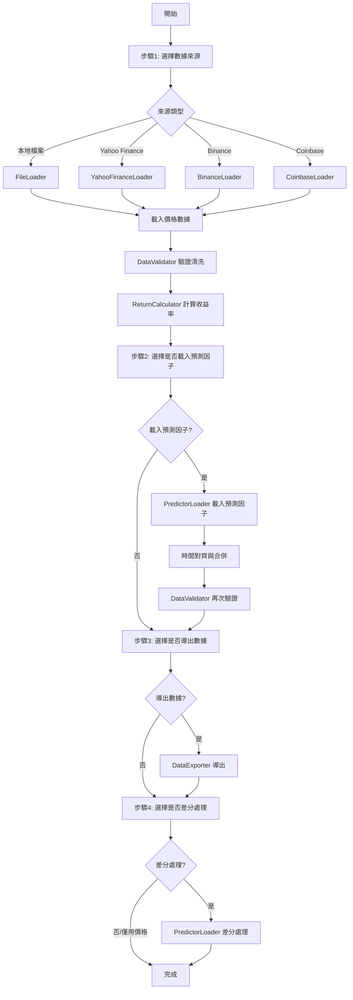

# dataloader 開發者說明文件

## 模組概覽

**dataloader** 是 Lo2cin4BT 量化回測框架的數據載入與前處理模組。本模組負責從多種來源載入行情數據、處理預測因子、進行數據驗證與清洗，並支援將處理後的數據導出為多種格式。

### 主要功能

- **多來源數據載入**：支援從 Yahoo Finance、Binance API、Coinbase API、本地檔案（Excel/CSV）載入行情數據
- **預測因子處理**：載入外部預測因子檔案，自動對齊時間序列，支援差分處理（減數差分、除數差分）
- **數據驗證與清洗**：自動驗證欄位完整性、處理缺失值、檢查數據型態
- **衍生欄位計算**：自動計算收益率（open_return、close_return、logreturn）
- **數據導出**：支援導出為 CSV、Excel、JSON 格式
- **統一使用者介面**：所有載入器共用一致的互動介面與訊息顯示格式

### 輸入與輸出

**輸入來源：**
- 本地檔案（Excel/CSV，位於 `records/dataloader/import/`）
- Yahoo Finance API（股票、指數、ETF）
- Binance API（加密貨幣）
- Coinbase API（加密貨幣）
- 預測因子檔案（Excel/CSV/JSON）

**輸出目標：**
- 標準化的 pandas DataFrame，欄位包含：Time, Open, High, Low, Close, Volume
- 衍生欄位：open_return, close_return, open_logreturn, close_logreturn
- 可選導出為 CSV、Excel、JSON 檔案（位於 `records/dataloader/`）

---

## 專案結構

```plaintext
dataloader/
├── __init__.py
├── base_loader.py              # 抽象基底類與主協調器
├── binance_loader.py           # Binance API 數據載入
├── coinbase_loader.py          # Coinbase API 數據載入
├── yfinance_loader.py          # Yahoo Finance 數據載入
├── file_loader.py              # 本地 Excel/CSV 數據載入
├── calculator_loader.py        # 收益率計算
├── predictor_loader.py         # 預測因子載入與差分處理
├── validator_loader.py         # 數據驗證與清洗
├── data_exporter_loader.py     # 數據導出
└── README.md                   # 本文件
```

---

## 核心模組說明

### 1. base_loader.py - 抽象基底類與主協調器

本檔案包含三個核心類別：

#### AbstractDataLoader（抽象基底類）

所有數據載入器的共同父類，提供統一的介面與共用方法。

**共用方法：**
- `show_error()`, `show_success()`, `show_warning()`, `show_info()` - 統一的訊息顯示（使用 Rich Panel）
- `get_user_input(prompt, default)` - 統一的使用者輸入處理
- `get_date_range(default_start, default_end)` - 互動式獲取日期範圍
- `get_frequency(default)` - 互動式獲取數據頻率
- `display_missing_values(data, columns)` - 顯示指定欄位的缺失值統計
- `standardize_columns(data)` - 將欄位名稱標準化為 Time, Open, High, Low, Close, Volume
- `ensure_required_columns(data, required_cols)` - 確保必要欄位存在
- `convert_numeric_columns(data, numeric_cols)` - 將指定欄位轉換為數值型態

**抽象方法：**
- `load()` - 所有子類必須實作此方法，回傳 `(DataFrame, frequency)` tuple

#### BaseDataLoader（主協調器）

負責協調整個數據載入流程，包含四個主要步驟：
1. 選擇價格數據來源（File/Yahoo Finance/Binance/Coinbase）
2. 輸入預測因子（可選）
3. 導出合併後數據（可選）
4. 選擇差分預測因子（可選）

**主要方法：**
- `run()` - 執行完整的數據載入流程
- `process_difference(data, predictor_col)` - 處理預測因子差分
- `print_step_panel(current_step, desc)` - 顯示步驟進度面板

#### DataLoader（包裝類）

提供向後兼容的簡化介面，內部調用 `BaseDataLoader`。

**主要方法：**
- `load_data()` - 執行數據載入流程，回傳處理後的 DataFrame 或特殊標記字串

---

### 2. 數據載入器（繼承 AbstractDataLoader）

所有數據載入器皆繼承自 `AbstractDataLoader`，實作 `load()` 方法。

#### binance_loader.py - Binance API 載入器

**功能：** 從 Binance API 下載加密貨幣歷史行情數據

**支援頻率：** 1m, 5m, 15m, 1h, 4h, 1d, 1w 等

**輸入參數：**
- 交易對（如 BTCUSDT，預設 BTCUSDT）
- 頻率（如 1d，預設 1d）
- 開始日期（預設 2020-01-01）
- 結束日期（預設當前日期）

**輸出：** 標準化 DataFrame + 頻率字串

**特點：** 使用無憑證 Client，自動計算收益率

#### coinbase_loader.py - Coinbase API 載入器

**功能：** 從 Coinbase API 下載加密貨幣歷史行情數據

**支援頻率：** 1m, 5m, 15m, 1h, 6h, 1d

**輸入參數：**
- 交易對（如 BTC-USD，預設 BTC-USD）
- 頻率（預設 1d）
- 開始日期（預設 2020-01-01）
- 結束日期（預設當前日期）

**輸出：** 標準化 DataFrame + 頻率字串

**特點：** 自動處理 API 限制（每次最多 300 筆數據），分批請求並合併

#### yfinance_loader.py - Yahoo Finance 載入器

**功能：** 從 Yahoo Finance API 下載股票、指數、ETF 歷史行情數據

**支援頻率：** 1m, 5m, 15m, 1h, 1d, 1wk, 1mo 等

**輸入參數：**
- 股票代碼（如 TSLA，預設 TSLA）
- 頻率（預設 1d）
- 開始日期（預設 2020-01-01）
- 結束日期（預設當前日期）

**輸出：** 標準化 DataFrame + 頻率字串

**特點：** 自動處理多級索引、展平欄位結構、移除無效行

#### file_loader.py - 本地檔案載入器

**功能：** 從本地 Excel 或 CSV 檔案載入行情數據

**支援格式：** .xlsx, .csv

**輸入參數：**
- 檔案路徑（可從 `records/dataloader/import/` 選擇或手動輸入完整路徑）
- 頻率（預設 1d）

**輸出：** 標準化 DataFrame + 頻率字串

**特點：**
- 自動掃描 `records/dataloader/import/` 目錄
- 支援從可用檔案列表選擇
- 自動標準化欄位名稱
- 若缺少 Volume 欄位，可選擇填充或設為 0

---

### 3. calculator_loader.py - 收益率計算

#### ReturnCalculator 類

**功能：** 批次計算價格收益率

**主要方法：** `calculate_returns()` - 計算四種收益率並新增到 DataFrame

**計算欄位：**
- `open_return` - Open 價格的簡單收益率
- `close_return` - Close 價格的簡單收益率
- `open_logreturn` - Open 價格的對數收益率
- `close_logreturn` - Close 價格的對數收益率

**技術特點：**
- 使用 numba JIT 加速計算
- 自動處理除數為 0 的情況
- 支援 Open/open 和 Close/close 欄位名稱

---

### 4. predictor_loader.py - 預測因子處理

#### PredictorLoader 類

**功能：** 載入外部預測因子檔案，與價格數據對齊合併，支援差分處理

**主要方法：**
- `load()` - 載入預測因子檔案並與價格數據合併
- `process_difference(data, predictor_col)` - 對指定欄位進行差分處理

**支援格式：** .xlsx, .csv（未來可擴充 .json）

**自動功能：**
- 掃描 `records/dataloader/import/` 目錄尋找可用檔案
- 自動識別時間欄位（候選名稱：time, date, timestamp, datetime, period，**不區分大小寫**）
- 自動對齊時間序列（inner join）
- 自動清洗數據（調用 DataValidator）

**差分處理：**
- **減數差分**：計算 `series.diff()`（適用於所有數據）
- **除數差分**：計算 `series.pct_change()`（僅適用於無 0 值的數據）
- 自動判斷是否包含 0 值，決定差分方式
- 同時產生原始欄位與差分欄位

**特殊模式：** 若使用者輸入 `0` 或留空，可選擇僅使用價格數據，跳過統計分析（回傳 `"__SKIP_STATANALYSER__"`）

---

### 5. validator_loader.py - 數據驗證與清洗

#### DataValidator 類

**功能：** 驗證與清洗數據，確保數據品質與格式正確

**主要方法：** `validate_and_clean()` - 執行完整的驗證與清洗流程

**驗證項目：**
- 時間欄位存在性（若無則生成序列索引）
- 時間格式正確性（自動轉換為 datetime）
- 時間重複值處理（按時間聚合取平均）
- 時間無效值處理（移除含 NaT 的行）
- 缺失值統計顯示（所有數值欄位）

**缺失值處理方式：**
- **A**：前向填充（Forward Fill）
- **B,N**：前 N 期均值填充（如 B,5 表示使用前 5 期移動平均）
- **C,x**：固定值填充（如 C,0 表示填充 0）

**輸出：** 清洗後的 DataFrame

#### print_dataframe_table 函數

**功能：** 使用 Rich Table 格式化顯示 DataFrame

**特點：** 數值型欄位以藍色顯示

---

### 6. data_exporter_loader.py - 數據導出

#### DataExporter 類

**功能：** 將處理後的數據導出為多種格式

**主要方法：** `export()` - 互動式選擇格式與檔名進行導出

**支援格式：**
- **CSV**：純文字格式，適合大數據處理
- **Excel (XLSX)**：可視化格式，適合人工檢視（使用 openpyxl 引擎）
- **JSON**：結構化格式，適合 API 對接（使用 records + lines 格式）

**導出位置：** 統一導出至 `records/dataloader/` 目錄

**錯誤處理：**
- 捕獲權限錯誤（PermissionError）
- 提示用戶檢查檔案是否被佔用

---

## 數據流與使用流程

### 完整流程圖



### 使用範例

#### 範例 1：使用主協調器（推薦）

這是最簡單的使用方式，系統會引導你完成所有步驟：

```python
from dataloader.base_loader import DataLoader

# 初始化載入器
dataloader = DataLoader()

# 執行完整載入流程（互動式）
data = dataloader.load_data()

# 檢查結果
if data is not None and data != "__SKIP_STATANALYSER__":
    print(f"數據載入成功，行數：{len(data)}")
    print(f"欄位：{data.columns.tolist()}")
    print(f"數據頻率：{dataloader.frequency}")
```

#### 範例 2：直接使用特定載入器

若你已知數據來源，可直接使用對應的載入器：

```python
from dataloader.binance_loader import BinanceLoader
from dataloader.yfinance_loader import YahooFinanceLoader

# 使用 Binance 載入器
binance_loader = BinanceLoader()
data, frequency = binance_loader.load()

# 或使用 Yahoo Finance 載入器
yfinance_loader = YahooFinanceLoader()
data, frequency = yfinance_loader.load()

# 所有載入器回傳格式一致：(DataFrame, frequency)
print(f"載入 {len(data)} 筆 {frequency} 數據")
```

#### 範例 3：組合使用各模組

若你需要更細緻的控制，可以單獨使用各模組：

```python
import pandas as pd
from dataloader.file_loader import FileLoader
from dataloader.validator_loader import DataValidator
from dataloader.calculator_loader import ReturnCalculator
from dataloader.predictor_loader import PredictorLoader
from dataloader.data_exporter_loader import DataExporter

# 步驟 1：載入價格數據
loader = FileLoader()
price_data, freq = loader.load()

# 步驟 2：驗證與清洗
validator = DataValidator(price_data)
clean_data = validator.validate_and_clean()

# 步驟 3：計算收益率
calculator = ReturnCalculator(clean_data)
data_with_returns = calculator.calculate_returns()

# 步驟 4：載入預測因子（可選）
predictor_loader = PredictorLoader(data_with_returns)
merged_data = predictor_loader.load()

# 步驟 5：差分處理（可選）
if merged_data is not None and merged_data != "__SKIP_STATANALYSER__":
    final_data, diff_cols, used_series = predictor_loader.process_difference(
        merged_data, 'predictor_column_name'
    )
    
    # 步驟 6：導出數據（可選）
    exporter = DataExporter(final_data)
    exporter.export()
```

---

## 設計架構與繼承關係

### 繼承架構圖

```
AbstractDataLoader (抽象基底類)
├── BinanceLoader
├── CoinbaseLoader
├── YahooFinanceLoader
└── FileLoader
```

### 設計原則

1. **統一介面**：所有載入器繼承自 `AbstractDataLoader`，確保方法與回傳格式一致
2. **共用方法**：UI 顯示、使用者輸入、欄位標準化等功能集中在基底類
3. **各司其職**：每個模組專注於單一功能，便於維護與測試
4. **易於擴充**：新增數據來源只需繼承 `AbstractDataLoader` 並實作 `load()` 方法
5. **錯誤處理**：每個模組都有完善的錯誤捕獲與使用者提示

---

## 維護與擴充指南

### 新增數據來源

若要新增新的數據來源（如 Kraken API），請按以下步驟操作：

**步驟 1：建立新檔案**
在 `dataloader/` 目錄下建立 `kraken_loader.py`

**步驟 2：繼承基底類並實作 `load()` 方法**

```python
from typing import Optional, Tuple
import pandas as pd
from .base_loader import AbstractDataLoader
from .calculator_loader import ReturnCalculator

class KrakenLoader(AbstractDataLoader):
    def load(self) -> Tuple[Optional[pd.DataFrame], str]:
        """從 Kraken API 載入數據"""
        
        # 1. 使用基底類方法取得使用者輸入
        symbol = self.get_user_input("請輸入交易對", "BTCUSD")
        frequency = self.get_frequency("1d")
        start_date, end_date = self.get_date_range()
        
        try:
            # 2. 調用 Kraken API 獲取數據
            # ... 你的 API 調用邏輯 ...
            
            # 3. 標準化欄位名稱
            data = data.rename(columns={
                'timestamp': 'Time',
                'open': 'Open',
                'high': 'High',
                'low': 'Low',
                'close': 'Close',
                'volume': 'Volume'
            })
            
            # 4. 轉換數據型態
            data = self.convert_numeric_columns(data)
            
            # 5. 計算收益率
            calculator = ReturnCalculator(data)
            data = calculator.calculate_returns()
            
            # 6. 顯示成功訊息
            self.show_success(f"從 Kraken 載入 '{symbol}' 成功，行數：{len(data)}")
            
            return data, frequency
            
        except Exception as e:
            self.show_error(f"Kraken API 錯誤：{e}")
            return None, frequency
```

**步驟 3：更新主協調器**
在 `base_loader.py` 的 `BaseDataLoader.run()` 方法中新增選項

**步驟 4：更新文件**
在本 README 中記錄新載入器的功能與使用方式

### 修改共用功能

若要修改所有載入器共用的功能（如訊息顯示格式），只需修改 `AbstractDataLoader` 類：

```python
# 在 base_loader.py 中修改
class AbstractDataLoader(ABC):
    def show_success(self, message: str) -> None:
        """Display success message in standardised panel"""
        # 修改這裡會影響所有繼承類
        self.console.print(
            Panel(
                f"✅ {message}",  # 新增 emoji
                title=self.panel_title,
                border_style=self.panel_success_style,
            )
        )
```

所有繼承的載入器會自動享有更新後的功能。

### 常見維護事項

**欄位名稱變更：** 若需變更標準欄位名稱（如將 Time 改為 Date），需同時更新：
- `AbstractDataLoader.standardize_columns()`
- 所有載入器的欄位重命名邏輯
- 下游模組（backtester, metricstracker 等）

**新增驗證規則：** 在 `DataValidator.validate_and_clean()` 中新增驗證邏輯

**新增衍生欄位：** 在 `ReturnCalculator.calculate_returns()` 中新增計算邏輯

**新增導出格式：** 在 `DataExporter.export()` 中新增格式選項

---

## 技術細節

### 依賴套件

- **pandas**：數據處理與分析
- **numpy**：數值計算
- **numba**：JIT 加速（用於收益率計算）
- **rich**：終端 UI 美化（Panel、Table、Console）
- **yfinance**：Yahoo Finance API
- **python-binance**：Binance API
- **requests**：HTTP 請求（用於 Coinbase API）
- **openpyxl**：Excel 檔案讀寫

### 欄位標準化規則

所有行情數據必須包含以下欄位（首字母大寫）：
- **Time**：時間（datetime 格式）
- **Open**：開盤價（float）
- **High**：最高價（float）
- **Low**：最低價（float）
- **Close**：收盤價（float）
- **Volume**：成交量（float，可選）

標準化過程會自動將以下欄位名稱轉換為標準格式（**不區分大小寫**）：
- `date`, `time`, `timestamp`, `datetime`, `period` → `Time`
- `open`, `o` → `Open`
- `high`, `h` → `High`
- `low`, `l` → `Low`
- `close`, `c` → `Close`
- `volume`, `vol`, `v` → `Volume`

**範例：** 無論您的檔案使用 `Date`、`DATE`、`date`、`Time`、`TIME`、`time`、`Period`、`PERIOD` 等，系統都會自動識別並轉換為標準的 `Time` 欄位。

### Timestamp 自動轉換功能

系統現在支援自動檢測並轉換Unix timestamp格式為標準datetime格式：

**支援的timestamp格式：**
- **秒級timestamp**：10位數字（如 1609459200，轉換後為 2021-01-01 00:00:00）
- **毫秒級timestamp**：13位數字（如 1609459200500，轉換後為 2021-01-01 00:00:00.500）

**自動轉換流程：**
1. 系統自動檢測Time欄位是否為數值型態
2. 根據數值大小判斷是秒級還是毫秒級timestamp
3. 使用`pd.to_datetime(unit="s")`或`pd.to_datetime(unit="ms")`進行轉換
4. 轉換完成後顯示轉換後的時間格式供確認

**適用範圍：**
- `file_loader.py` - 本地檔案載入時自動檢測
- `predictor_loader.py` - 預測因子載入時自動檢測
- `DataLoader_autorunner.py` - 自動化回測時自動檢測

**使用範例：**
```python
# 假設你的CSV檔案包含timestamp格式的時間欄位：
# Time,Open,High,Low,Close,Volume
# 1609459200,29000,29500,28800,29200,1000
# 1609545600,29200,29800,29000,29500,1200

from dataloader.file_loader import FileLoader

loader = FileLoader()
data, freq = loader.load()

# 系統會自動檢測並顯示：
# "檢測到秒級timestamp格式，正在轉換..."
# "timestamp轉換成功，格式為：2021-01-01 00:00:00"

print(data['Time'].dtype)  # datetime64[ns]
print(data['Time'].iloc[0])  # 2021-01-01 00:00:00
```

**Matchup機制：**
當您同時使用價格數據和預測因子數據時，系統會自動：
1. 將兩邊的時間欄位都轉換為datetime格式（包括timestamp自動轉換）
2. 使用`inner join`根據Time欄位進行對齊合併
3. 只保留時間交集的數據行

這確保了即使價格數據和預測因子使用不同的時間格式（一邊是datetime字符串，一邊是timestamp），系統也能正確對齊合併。

### 差分處理邏輯

差分處理用於將非平穩時間序列（如價格）轉換為平穩序列（如收益率）：

**減數差分（Differencing）：**
- 公式：`diff[t] = value[t] - value[t-1]`
- 適用：所有數據
- 欄位名稱：`{原欄位名}_diff_sub`

**除數差分（Percentage Change）：**
- 公式：`pct_change[t] = (value[t] - value[t-1]) / value[t-1]`
- 適用：無 0 值的數據
- 欄位名稱：`{原欄位名}_diff_div`

系統會自動判斷數據是否包含 0 值：
- 若包含 0 值，僅產生減數差分
- 若不含 0 值，同時產生減數差分與除數差分

### 錯誤處理策略

- **API 錯誤**：捕獲 HTTP 錯誤、網路超時，顯示明確錯誤訊息並回傳 None
- **檔案錯誤**：捕獲檔案不存在、權限不足、格式錯誤，提示用戶並允許重試
- **數據錯誤**：捕獲欄位缺失、型態錯誤、時間格式錯誤，提供修復建議
- **使用者輸入錯誤**：驗證輸入範圍與格式，提示並要求重新輸入

---

## 疑難排解

### 1. API 連接失敗 05/10/2025
**問題詳情：** 無法連接 Binance 或 Coinbase API，顯示連接超時或 HTTP 錯誤。

**可能原因：**
- 網路連線問題
- API 服務暫時無法使用
- 防火牆或代理設定阻擋連線

**解決方法：**
- 檢查網路連線
- 確認 API 服務狀態（查看官方狀態頁面）
- 若使用代理，確認代理設定正確
- 改用其他數據來源（Yahoo Finance 或本地檔案）

---

### 2. 欄位名稱不一致 05/10/2025
**問題詳情：** 載入檔案後，下游模組報錯「找不到 Open 欄位」。

**可能原因：**
- 本地檔案欄位名稱未使用標準格式（Time, Open, High, Low, Close, Volume）
- 欄位名稱包含額外空格或特殊字元

**解決方法：**
- 使用 `FileLoader` 時，系統會自動標準化常見欄位名稱
- 若自動標準化失敗，請手動修改檔案欄位名稱為標準格式
- 確保欄位名稱首字母大寫（Time, Open, High, Low, Close, Volume）

---

### 3. 時間格式無法識別 05/10/2025
**問題詳情：** 載入預測因子時，顯示「時間格式轉換失敗」或大量時間值無效。

**可能原因：**
- 時間欄位格式不標準（如 31-12-2000 vs 2000-12-31）
- 時間欄位包含非時間資料
- Excel 日期被誤讀為數值

**解決方法：**
- 建議使用標準 ISO 8601 格式：YYYY-MM-DD（如 2023-01-01）
- 在 `PredictorLoader` 提示時，輸入正確的時間格式（如 %d-%m-%Y 表示 31-12-2000）
- 在 Excel 中確認時間欄位格式為「日期」而非「一般」或「數值」
- 導出 CSV 前先在 Excel 中將時間欄位格式化為文字

---

### 4. 預測因子合併後數據為空 05/10/2025
**問題詳情：** 載入預測因子並與價格數據合併後，回傳空 DataFrame。

**可能原因：**
- 價格數據與預測因子的時間範圍無交集
- 時間格式不一致（如價格用日期，預測因子用時間戳）
- 時區差異導致時間無法對齊

**解決方法：**
- 確認兩份數據的時間範圍有重疊
- 統一時間格式（都使用日期或都使用時間戳）
- 在合併前檢視兩份數據的時間範圍：
```python
print(f"價格數據時間範圍：{price_data['Time'].min()} ~ {price_data['Time'].max()}")
print(f"預測因子時間範圍：{predictor_data['Time'].min()} ~ {predictor_data['Time'].max()}")
```

---

### 5. 缺失值處理後仍有 NaN 05/10/2025
**問題詳情：** 經過 `DataValidator` 處理後，數據仍包含 NaN 值。

**可能原因：**
- 某些欄位所有值都是 NaN，無法填充
- 選擇的填充方式不適合該欄位（如選擇前向填充但第一個值就是 NaN）

**解決方法：**
- 檢查原始數據，確認欄位是否有有效值
- 針對第一個值為 NaN 的情況，選擇「固定值填充」（選項 C,0）
- 若整個欄位都是 NaN，考慮移除該欄位或從數據源重新載入

---

### 6. 導出檔案時權限錯誤 05/10/2025
**問題詳情：** 嘗試導出數據時顯示 `PermissionError`。

**可能原因：**
- 目標檔案正被其他程式開啟（如 Excel）
- 對目標目錄沒有寫入權限
- 檔案被標記為唯讀

**解決方法：**
- 關閉所有開啟該檔案的程式
- 確認對 `records/dataloader/` 目錄有寫入權限
- 若檔案為唯讀，移除唯讀屬性
- 嘗試使用不同的檔案名稱

---

### 7. Timestamp格式無法識別 09/10/2025
**問題詳情：** 載入含有timestamp的檔案時，時間欄位無法被正確識別或轉換。

**可能原因：**
- Timestamp數值超出合理範圍（如使用微秒級timestamp）
- Timestamp欄位被儲存為字符串而非數值
- Timestamp為負數或其他特殊值

**解決方法：**
- 確認timestamp為正整數（秒級約10位數，毫秒級約13位數）
- 若timestamp為字符串，確保檔案中沒有引號包圍數值
- 使用以下Python代碼驗證timestamp範圍：
```python
import pandas as pd
# 檢查timestamp是否在合理範圍
timestamp = 1609459200  # 你的timestamp
print(pd.to_datetime(timestamp, unit='s'))  # 秒級
print(pd.to_datetime(timestamp * 1000, unit='ms'))  # 毫秒級
```
- 若仍無法自動轉換，可在Excel或Python中預先將timestamp轉換為標準日期格式再導入

---

### 8. 差分處理後數據異常 05/10/2025
**問題詳情：** 差分處理後，數值出現極端值或全為 NaN。

**可能原因：**
- 原始數據包含異常值（如突然的跳空或資料錯誤）
- 原始數據中有大量連續的相同值
- 選擇除數差分但數據包含 0 值

**解決方法：**
- 在差分前先檢查原始數據是否有異常：
```python
print(data[predictor_col].describe())
print(data[predictor_col].value_counts())
```
- 若數據包含 0 值，系統會自動限制只能使用減數差分
- 考慮先對原始數據進行異常值處理（如設定上下限）

---
