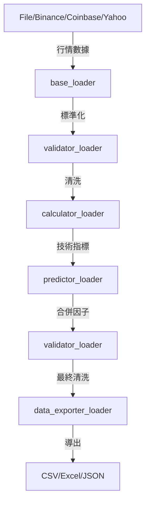

# dataloader 開發者說明文件

## 模組概覽（Module Overview）

**dataloader** 是 Lo2cin4BT 量化回測框架的標準化數據載入與前處理模組，負責將多種來源的行情數據、預測因子、技術指標等載入、驗證、轉換與導出，確保下游回測與分析流程的數據品質與一致性。

- **輸入來源**：本地 Excel/CSV、Yahoo Finance、Binance API、Coinbase API、外部預測因子檔案
- **輸出目標**：標準化 DataFrame，支援導出為 CSV、Excel、JSON 等格式，供回測、分析、特徵工程等模組使用

---

## 開發目標（Development Goals）

- 提供統一、可擴充的數據載入介面，支援多種行情與因子來源
- 嚴格數據驗證與清洗，確保欄位、型態、缺失值處理一致
- 支援批次技術指標、衍生欄位自動計算
- 方便用戶互動式選擇數據來源、格式與導出方式
- 保持模組化、低耦合、易於擴充與維護

---

## 專案結構（Project Structure）

```plaintext
dataloader/
├── __init__.py
├── base_loader.py            # 抽象基底類 & 主協調器
├── binance_loader.py         # Binance API 數據載入（繼承 AbstractDataLoader）
├── coinbase_loader.py        # Coinbase API 數據載入（繼承 AbstractDataLoader）
├── yfinance_loader.py        # Yahoo Finance 數據載入（繼承 AbstractDataLoader）
├── file_loader.py            # 本地 Excel/CSV 數據載入（繼承 AbstractDataLoader）
├── calculator_loader.py      # 技術指標/衍生欄位計算
├── predictor_loader.py       # 預測因子/特徵工程處理
├── validator_loader.py       # 數據驗證與清洗
├── data_exporter_loader.py    # 數據導出（CSV/Excel/JSON）
├── README.md                 # 本文件
```

- **base_loader.py**：包含 `AbstractDataLoader` 抽象基底類（提供共用方法）和 `BaseDataLoader`/`DataLoader` 主協調器
- **binance_loader.py**：繼承 `AbstractDataLoader`，連接 Binance API，下載多頻率行情數據
- **coinbase_loader.py**：繼承 `AbstractDataLoader`，連接 Coinbase API，下載多頻率行情數據
- **yfinance_loader.py**：繼承 `AbstractDataLoader`，連接 Yahoo Finance API，下載行情數據
- **file_loader.py**：繼承 `AbstractDataLoader`，讀取本地 Excel/CSV，欄位標準化
- **calculator_loader.py**：批次計算技術指標、收益率等衍生欄位
- **predictor_loader.py**：載入、對齊、合併外部預測因子，支援特徵工程
- **validator_loader.py**：多層次數據驗證、型態與缺失值處理
- **data_exporter_loader.py**：將處理後數據導出為多種格式

---

## 核心模組功能（Core Components）

### 1. base_loader.py

- **功能**：提供抽象基底類 `AbstractDataLoader` 和主協調器 `BaseDataLoader`/`DataLoader`
- **AbstractDataLoader 共用方法**：
  - `show_error()`, `show_success()`, `show_warning()`, `show_info()` - 統一的訊息顯示
  - `get_user_input()`, `get_date_range()`, `get_frequency()` - 統一的使用者輸入
  - `display_missing_values()` - 缺失值統計顯示
  - `standardize_columns()` - 欄位名稱標準化
  - `ensure_required_columns()` - 確保必要欄位存在
  - `convert_numeric_columns()` - 欄位數值型態轉換
- **主要處理**：定義 `load()` 抽象方法，所有子類必須實作
- **輸入**：數據來源參數
- **輸出**：標準化 DataFrame

### 2. binance_loader.py / coinbase_loader.py / yfinance_loader.py / file_loader.py

- **功能**：分別對接 Binance API、Coinbase API、Yahoo Finance API、本地檔案，下載並標準化行情數據
- **主要處理**：互動式輸入參數、欄位標準化、缺失值處理
- **輸入**：API 參數或檔案路徑
- **輸出**：標準化 DataFrame

### 3. calculator_loader.py

- **功能**：批次計算技術指標（如移動平均、收益率等）
- **主要處理**：自動新增 open_return、close_return、logreturn 等欄位
- **輸入**：行情 DataFrame
- **輸出**：含衍生欄位的 DataFrame

### 4. predictor_loader.py

- **功能**：載入、對齊、合併外部預測因子，支援特徵工程
- **主要處理**：自動辨識時間欄位、合併對齊、差分處理
- **輸入**：預測因子檔案、行情 DataFrame
- **輸出**：合併後 DataFrame

### 5. validator_loader.py

- **功能**：多層次數據驗證與清洗
- **主要處理**：欄位完整性、型態、缺失值、時間序列一致性
- **輸入**：任意 DataFrame
- **輸出**：清洗後 DataFrame

### 6. data_exporter_loader.py

- **功能**：將處理後數據導出為 CSV、Excel、JSON 等格式
- **主要處理**：互動式選擇格式、檔名，統一導出路徑
- **輸入**：DataFrame
- **輸出**：指定格式檔案

---

## 數據流與組件依賴（Data Flow & Dependencies）



- 各數據來源 → 標準化 → 驗證清洗 → 衍生欄位 → 合併因子 → 再驗證 → 導出
- 每個步驟皆可獨立調用，亦可串聯為完整流程

---

## 主要類別與方法（Key Classes & Methods）

- `AbstractDataLoader`：**抽象基底類**，提供所有數據載入器的共用功能
  - 統一的 UI 訊息顯示（error, success, warning, info）
  - 標準化的使用者輸入處理
  - 通用的數據處理方法（欄位標準化、型態轉換等）
- `BaseDataLoader` / `DataLoader`：主流程協調器，互動式選擇數據來源、載入、驗證、合併、導出
- `FileLoader` / `BinanceLoader` / `CoinbaseLoader` / `YahooFinanceLoader`：
  - **皆繼承自 `AbstractDataLoader`**
  - 各自實作 `load()` 方法，負責不同來源的行情數據載入
  - 自動享有基底類的所有共用方法
- `PredictorLoader`：載入並合併外部預測因子
- `DataValidator`：欄位、型態、缺失值、時間序列驗證與清洗
- `ReturnCalculator`：自動計算 open/close return、logreturn 等欄位
- `DataExporter`：導出數據為多種格式

---

## 維護重點（Maintenance Notes）

- **新增數據載入器時**，必須繼承 `AbstractDataLoader` 並實作 `load()` 方法
- **修改共用功能時**，只需更新 `AbstractDataLoader` 基底類，所有子類自動享有更新
- 新增/修改數據來源、欄位、格式時，**務必同步更新相關類別**
- 所有互動式 input() 應使用基底類的 `get_user_input()` 方法，確保一致性
- 欄位名稱、型態、時間格式需全模組統一（如 'Time', 'Open', 'Close' 等）
- 每次擴充功能、格式、驗證規則時，請同步更新本 README 與頂部註解
- 若有下游依賴（如 BacktestEngine、metricstracker），需同步檢查數據流與欄位對應

## 範例流程（Example Workflow）

### 使用主協調器（推薦）

```python
from dataloader.base_loader import DataLoader

dataloader = DataLoader()
data = dataloader.load_data()  # 互動式選擇來源、驗證、合併、導出
```

### 直接使用特定載入器

```python
from dataloader.binance_loader import BinanceLoader
from dataloader.yfinance_loader import YahooFinanceLoader

# 所有載入器都繼承自 AbstractDataLoader，享有統一的介面和方法
loader = BinanceLoader()  # 或 YahooFinanceLoader(), FileLoader(), CoinbaseLoader()
data, frequency = loader.load()  # 回傳 (DataFrame, frequency) tuple
```

---

## 技術備註（Technical Notes）

- **繼承架構**：所有數據載入器皆繼承自 `AbstractDataLoader`，確保介面一致性
- **欄位標準化**：所有行情數據欄位統一為 'Time', 'Open', 'High', 'Low', 'Close', 'Volume'
- **技術指標**：自動計算 open_return, close_return, open_logreturn, close_logreturn
- **預測因子**：支援 Excel/CSV，時間欄位自動對齊，支援差分處理
- **驗證規則**：型態、缺失值、重複值、時間序列完整性
- **導出格式**：CSV、Excel（.xlsx）、JSON，統一導出至 records 目錄
- **依賴套件**：pandas, numpy, openpyxl, yfinance, binance, numba, rich（用於統一 UI）

---

如需擴充新數據來源、技術指標或有特殊需求，請先參考本 README 並同步更新相關註解與文件。

---

## 疑難排解（持續更新）

1. API 金鑰/參數錯誤 22/07/2025
問題詳情：請確認 Binance API 金鑰、頻率、日期等參數正確。
解決方法：請依官方文件與本 README 設定。

2. 欄位缺失/型態錯誤 22/07/2025
問題詳情：請使用 validator_loader 進行自動檢查與補全。
解決方法：執行 dataloader/validator_loader.py。

3. 預測因子合併失敗 22/07/2025
問題詳情：請確認時間欄位格式一致，並檢查缺失值。
解決方法：先補齊缺失值再合併。

4. 批次計算/合併時欄位衝突 22/07/2025
問題詳情：請檢查欄位命名規則，避免重複。
解決方法：統一命名規則。

---
