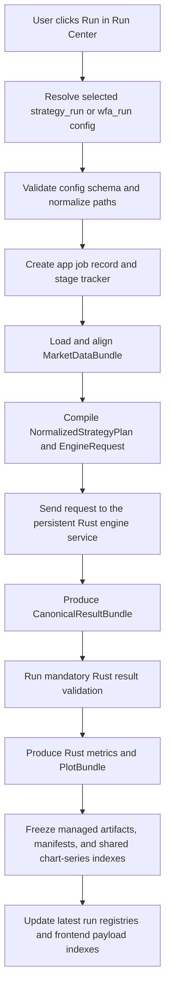

# Runtime Flow

This note is a reader map for `app/runtime/runtime.py`. `AppRuntimeService`
is the Python control plane, so it touches config discovery, job stages,
market-data loading, artifact freezing, registries, payload indexes, and
lineage. Result-changing strategy, simulation, risk, validation, metric, and
plot-projection calculations belong to the shared Rust engine.

## Run Center: Run Button Flow

## Ten Steps

1. The app receives a run request from Run Center.
2. `AppRuntimeService` resolves the config file from `workspace/runs`,
   `workspace/wfa`, or bundled examples.
3. The config is validated and normalized into the current `strategy_run` or
   `wfa_run` contract.
4. A job record is created so the UI can show progress stages.
5. Market data is loaded through `dataloader/market_data_loader.py`, aligned,
   and materialized as one `MarketDataBundle`.
6. Strategy semantics are compiled into `NormalizedStrategyPlan` and
   `EngineRequest`; profiles describe authoring shape, not engine selection.
7. The persistent Rust engine service executes supported operations, signals,
   target weights, fills, holdings, costs, risk actions, and equity accounting.
8. Every candidate returns a `CanonicalResultBundle` and must pass the Rust
   result validator before downstream use.
9. Rust metricstracker and plot projection produce canonical metrics and
   `PlotBundle`; Python freezes these under the owning app run with manifests,
   lineage, and content-addressed shared chart-series indexes.
10. Registry-first frontend payload indexes expose Metrics Overview,
    Backtests, Parameter Matrix, WFA, and related views without recomputing
    result truth in the UI.

## Supported Shapes Inside One Engine

| Strategy shape | Shared-engine implementation |
| --- | --- |
| Single-asset signal with next-open execution | Signal and indicator operations are precomputed in Rust, followed by sequential Rust simulation and accounting. |
| Monthly Nth-weekday same-session event | Rust calendar trigger and same-session simulation. |
| Multi-asset reset timer | Rust signal, timeline actions, timed restore, and sequential portfolio accounting. |
| Calendar baseline/event overlay | Rust calendar trigger, target-weight actions, and sequential portfolio accounting. |
| Multi-asset daily rank / top-N selection | Rust feature calculation, eligibility, ranking, allocation, and sequential accounting. |
| Fixed allocation rebalance | Rust schedule, target weights, fills, costs, and accounting. |
| Parameter Matrix / WFA | The control plane expands candidates or windows, while every candidate still enters the same EngineRequest service and result contract. |

Grouped batch kernels reduce repeated work for compatible candidates, but they
are internal optimizations. They are not public strategy-family paths.

## Loader Boundary

Runtime code should use `dataloader/market_data_loader.py` for
provider/file-backed market frames. Single-asset strategies are one-symbol
`strategy_run` configs loaded by the unified runner.

## Rust Boundary

The supported Python/Rust split is contract-based and process-based:

- Python owns config validation and normalization, provider/file market-data
  loading, scheduling, service transport, artifact/manifest/registry I/O,
  payload indexes, and app job state.
- Rust owns supported indicators and computed fields, signals, calendar
  triggers, ranking, target weights, sequential simulation/accounting, risk
  actions, canonical result validation, metrics, and PlotBundle projection.
- `backtester/RustCoreBridge_backtester.py` is the runtime boundary. It manages
  the repo-pinned persistent `engine_service_cli` process and exchanges
  JSON/parquet-backed contracts with it.

Do not describe the active runtime as a PyO3 or maturin extension path. That is
not the current production integration model.

## App-Managed Output Boundary

The browser pages are registry-first. Metrics Overview, Backtests,
Parameter Matrix, and WFA read app-managed runs from `outputs/app/latest_runs.json`,
`outputs/app/run_registry/`, artifact manifests, snapshots, and chart payloads.

Backtest, metrics, portfolio, and statistical artifacts are written under the
owning run in `outputs/app/run_snapshots/<run_id>/managed_artifacts/`. Repeated
chart series are stored once as content-addressed objects and referenced by
small payload indexes. Standalone tools must receive an explicit caller-owned
output directory; they must not recreate module-specific folders under
`outputs/`. WFA and rolling-validation artifacts are registered under the same
app-managed run boundary.
