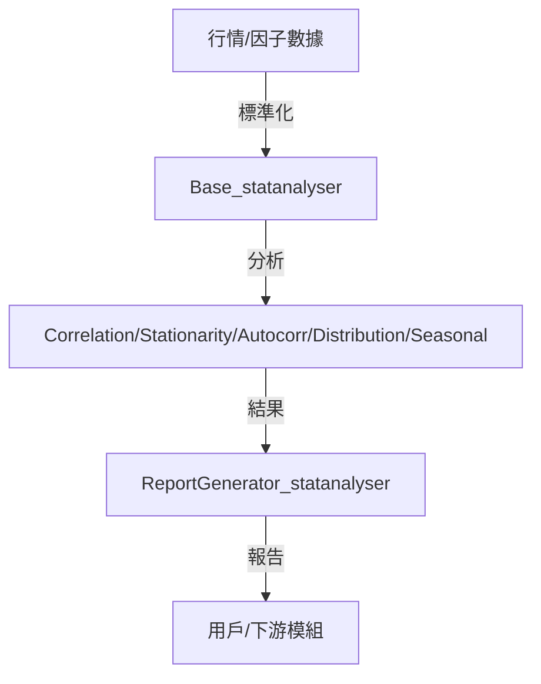

# statanalyser 開發者說明文件

## 模組概覽（Module Overview）

**statanalyser** 是 Lo2cin4BT 量化回測框架的統計分析模組，負責對行情數據、預測因子等進行相關性、穩定性、自相關、分布、季節性等多維度統計檢定與特徵分析，並自動產生標準化分析報告，協助策略開發與因子篩選。

- **輸入來源**：標準化 DataFrame（含行情、因子、收益率等欄位）
- **輸出目標**：統計分析結果 dict、標準化報告（txt/csv/excel），供策略開發、因子篩選、回測流程參考

---

## 開發目標（Development Goals）

- 提供標準化、可擴充的統計分析介面，支援多種檢定方法
- 自動化因子相關性、穩定性、分布、季節性等分析
- 支援批次分析與自動產生報告，便於策略開發決策
- 保持模組化、低耦合、易於擴充與維護

---

## 專案結構（Project Structure）

```plaintext
statanalyser/
├── __init__.py
├── Base_statanalyser.py              # 統計分析基底類，定義統一介面
├── CorrelationTest_statanalyser.py   # 因子-收益率相關性檢定
├── StationarityTest_statanalyser.py  # 穩定性檢定（ADF/KPSS）
├── AutocorrelationTest_statanalyser.py # 自相關檢定（ACF/PACF）
├── DistributionTest_statanalyser.py  # 分布檢定（常態性、偏度、峰度）
├── SeasonalAnalysis_statanalyser.py  # 季節性分析（週期性檢定）
├── ReportGenerator_statanalyser.py   # 統一報告產生器
├── README.md                         # 本文件
```

- **Base_statanalyser.py**：定義所有統計分析器的抽象基底類與介面規範
- **CorrelationTest_statanalyser.py**：多種相關性檢定（Pearson、Spearman、Chatterjee）
- **StationarityTest_statanalyser.py**：ADF、KPSS 等穩定性檢定
- **AutocorrelationTest_statanalyser.py**：ACF/PACF 自相關分析，支援圖形化
- **DistributionTest_statanalyser.py**：常態性、偏度、峰度等分布檢定
- **SeasonalAnalysis_statanalyser.py**：週期性、季節性分析
- **ReportGenerator_statanalyser.py**：自動彙整分析結果並產生報告

---

## 核心模組功能（Core Components）

### 1. Base_statanalyser.py

- **功能**：定義統計分析器的標準介面與繼承規範
- **主要處理**：規範 analyze、get_results 等方法，所有子類必須實作
- **輸入**：標準化 DataFrame、欄位名稱
- **輸出**：分析結果 dict

### 2. CorrelationTest_statanalyser.py

- **功能**：計算因子與收益率的相關性（Pearson、Spearman、Chatterjee）
- **主要處理**：支援多種滯後期、相關性衰減分析
- **輸入**：DataFrame、因子欄、收益率欄
- **輸出**：相關性指標 dict

### 3. StationarityTest_statanalyser.py

- **功能**：檢定因子與收益率的穩定性（ADF、KPSS）
- **主要處理**：自動判斷平穩/非平穩，給出建議
- **輸入**：DataFrame、欄位名稱
- **輸出**：穩定性檢定結果 dict

### 4. AutocorrelationTest_statanalyser.py

- **功能**：自相關分析（ACF/PACF），可選圖形化
- **主要處理**：自動判斷顯著自相關滯後期，建議 ARIMA(p,q) 模型
- **輸入**：DataFrame、欄位名稱
- **輸出**：自相關指標 dict

### 5. DistributionTest_statanalyser.py

- **功能**：分布檢定（常態性、偏度、峰度）
- **主要處理**：自動判斷是否適合 Z-Score、分位數等分析
- **輸入**：DataFrame、欄位名稱
- **輸出**：分布特徵 dict

### 6. SeasonalAnalysis_statanalyser.py

- **功能**：季節性/週期性分析
- **主要處理**：自動偵測週期、強度，建議是否納入週期性策略
- **輸入**：DataFrame、欄位名稱
- **輸出**：週期性特徵 dict

### 7. ReportGenerator_statanalyser.py

- **功能**：自動彙整所有分析結果，產生標準化報告（txt/csv/excel）
- **主要處理**：自動產生策略建議、保存分析數據
- **輸入**：分析結果 dict
- **輸出**：報告檔案

---

## 數據流與組件依賴（Data Flow & Dependencies）



- 數據標準化 → 各類統計分析 → 統一報告產生 → 用戶/下游模組
- 各分析器可獨立調用，亦可批次串聯

---

## 主要類別與方法（Key Classes & Methods）

- `BaseStatAnalyser`：所有分析器基底類，規範 analyze、get_results 等方法
- `CorrelationTest`：相關性檢定，支援多種方法與滯後期
- `StationarityTest`：ADF/KPSS 穩定性檢定
- `AutocorrelationTest`：ACF/PACF 自相關分析
- `DistributionTest`：常態性、偏度、峰度檢定
- `SeasonalAnalysis`：週期性、季節性分析
- `ReportGenerator`：自動彙整分析結果並產生報告

---

## 維護重點（Maintenance Notes）

- 新增/修改分析方法、欄位、格式時，**務必同步更新 Base_statanalyser 及所有依賴子類**
- 所有互動式 input() 需有預設值與錯誤提示，避免 crash
- 欄位名稱、型態、時間格式需全模組統一（如 'Time', 'Open', 'Close' 等）
- 每次擴充功能、格式、驗證規則時，請同步更新本 README 與頂部註解
- 若有下游依賴（如 metricstracker、backtester），需同步檢查數據流與欄位對應

---

## 疑難排解（持續更新）

1. 數據欄位缺失/型態錯誤 22/07/2025
問題詳情：請先用 dataloader/validator_loader 處理。
解決方法：執行 dataloader/validator_loader.py。

2. 分析失敗/報錯 22/07/2025
問題詳情：請確認數據長度、型態、欄位名稱正確。
解決方法：修正數據格式後重試。

3. 報告產生失敗 22/07/2025
問題詳情：請確認目錄權限與檔案未被佔用。
解決方法：關閉佔用程式或調整權限。

4. 批次分析時欄位衝突 22/07/2025
問題詳情：請檢查欄位命名規則，避免重複。
解決方法：統一命名規則。

---

## 範例流程（Example Workflow）

```python
from statanalyser.CorrelationTest_statanalyser import CorrelationTest

test = CorrelationTest(data, predictor_col='因子欄', return_col='close_return')
result = test.analyze()
```

---

## 技術備註（Technical Notes）

- **欄位標準化**：所有分析欄位建議統一為 'Time', 'Open', 'High', 'Low', 'Close', 'Volume', 'close_return', 'open_return' 等
- **相關性分析**：支援 Pearson、Spearman、Chatterjee，並自動分析滯後期與衰減
- **穩定性分析**：ADF、KPSS，並自動判斷平穩/非平穩
- **自相關分析**：ACF/PACF，支援圖形化
- **分布分析**：常態性、偏度、峰度，並給出 Z-Score/分位數建議
- **季節性分析**：自動偵測週期與強度，建議是否納入策略
- **報告產生**：支援 txt/csv/excel，統一輸出至 stats_analysis_results 目錄
- **依賴套件**：pandas, numpy, scipy, statsmodels, plotly

---

如需擴充新分析方法、報告格式或有特殊需求，請先參考本 README 並同步更新相關註解與文件。
