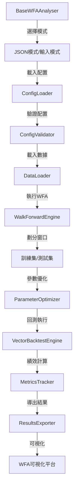

# wfanalyser 開發者說明文件

## 模組概覽（Module Overview）

**wfanalyser** 是 Lo2cin4BT 量化回測框架的滾動前向分析（Walk-Forward Analysis, WFA）模組，負責執行滾動窗口參數優化與回測驗證，通過將數據劃分為訓練集和測試集，在訓練集上優化參數，在測試集上驗證策略表現，避免過度擬合並評估策略的穩健性。

- **輸入來源**：JSON 配置文件（含數據源、策略參數、窗口配置等）或命令行互動輸入
- **輸出目標**：WFA 結果（Parquet/CSV 格式），包含每個窗口的最優參數、IS/OOS 績效指標等，供可視化平台分析

---

## 開發目標（Development Goals）

- 提供標準化、可擴充的 WFA 執行介面，支援配置文件驅動和互動式輸入兩種模式
- 自動化窗口劃分、參數優化、回測執行、績效計算等全流程
- 支援多配置批次執行，便於策略對比與分析
- 保持模組化、低耦合、易於擴充與維護
- 重用現有 dataloader、backtester、metricstracker 模組，避免重複實現

---

## 專案結構（Project Structure）

```plaintext
wfanalyser/
├── __init__.py
├── Base_wfanalyser.py              # WFA 核心控制器，協調整個流程
├── ConfigLoader_wfanalyser.py      # 配置文件載入器
├── ConfigSelector_wfanalyser.py   # 配置文件選擇器（互動式）
├── ConfigValidator_wfanalyser.py  # 配置文件驗證器
├── DataLoader_wfanalyser.py        # 數據載入器（重用原版 dataloader）
├── WalkForwardEngine_wfanalyser.py # WFA 核心引擎（窗口劃分、執行）
├── ParameterOptimizer_wfanalyser.py # 參數優化器（訓練集優化）
├── ResultsExporter_wfanalyser.py   # 結果導出器（Parquet/CSV）
├── README.md                        # 本文件
├── WFA.md                          # 開發計劃與疑難排解
└── BACKTESTER_VS_WFA_PARALLELIZATION.md # 並行化說明
```

- **Base_wfanalyser.py**：WFA 核心控制器，協調配置管理、數據載入、WFA 執行、結果導出等全流程
- **ConfigLoader_wfanalyser.py**：從 JSON 文件讀取配置，解析和轉換配置參數
- **ConfigSelector_wfanalyser.py**：提供互動式配置文件選擇介面，支援單個或多個文件選擇
- **ConfigValidator_wfanalyser.py**：驗證配置文件的完整性和正確性，提供詳細錯誤報告
- **DataLoader_wfanalyser.py**：重用原版 dataloader 模組，根據配置自動載入數據
- **WalkForwardEngine_wfanalyser.py**：WFA 核心引擎，負責窗口劃分、參數優化、回測執行
- **ParameterOptimizer_wfanalyser.py**：在訓練集上尋找最優參數，支援 Sharpe/Calmar 優化目標
- **ResultsExporter_wfanalyser.py**：將 WFA 結果導出為 Parquet/CSV 格式，與可視化平台兼容

---

## 核心模組功能（Core Components）

### 1. Base_wfanalyser.py

- **功能**：WFA 核心控制器，協調整個 Walk-Forward Analysis 流程
- **主要處理**：模式選擇（JSON/輸入）、配置管理、流程協調、結果導出
- **輸入**：執行模式選擇、配置文件路徑（JSON 模式）或互動輸入（輸入模式）
- **輸出**：WFA 結果文件（Parquet/CSV）

### 2. ConfigLoader_wfanalyser.py

- **功能**：從 JSON 文件載入 WFA 配置，解析和轉換配置參數
- **主要處理**：讀取 JSON 文件、解析配置結構、轉換為標準化配置對象
- **輸入**：配置文件路徑
- **輸出**：標準化配置對象（ConfigData）

### 3. ConfigSelector_wfanalyser.py

- **功能**：提供互動式配置文件選擇介面，支援單個或多個文件選擇
- **主要處理**：掃描配置目錄、顯示文件列表、處理用戶選擇
- **輸入**：配置目錄路徑、用戶選擇
- **輸出**：選中的配置文件路徑列表

### 4. ConfigValidator_wfanalyser.py

- **功能**：驗證配置文件的完整性和正確性，提供詳細錯誤報告
- **主要處理**：檢查必要欄位、驗證數據類型、驗證邏輯關係
- **輸入**：配置文件路徑或配置數據
- **輸出**：驗證結果（True/False）和錯誤報告

### 5. DataLoader_wfanalyser.py

- **功能**：重用原版 dataloader 模組，根據配置自動載入數據
- **主要處理**：調用原版 dataloader、處理預測因子、返回標準化數據
- **輸入**：配置數據（含數據源信息）
- **輸出**：標準化 DataFrame（含行情、因子等欄位）

### 6. WalkForwardEngine_wfanalyser.py

- **功能**：WFA 核心引擎，執行窗口劃分、參數優化、回測執行
- **主要處理**：劃分訓練/測試窗口、調用參數優化器、執行回測、收集結果
- **輸入**：配置數據、載入的數據
- **輸出**：WFA 結果字典（含每個窗口的最優參數、IS/OOS 績效等）

### 7. ParameterOptimizer_wfanalyser.py

- **功能**：在訓練集上尋找最優參數，支援 Sharpe/Calmar 優化目標
- **主要處理**：生成參數組合、執行回測、計算績效、選擇最優參數
- **輸入**：訓練數據、配置數據、優化目標（Sharpe/Calmar）
- **輸出**：最優參數字典

### 8. ResultsExporter_wfanalyser.py

- **功能**：將 WFA 結果導出為 Parquet/CSV 格式，與可視化平台兼容
- **主要處理**：格式化結果數據、統一參數格式、導出文件
- **輸入**：WFA 結果字典、輸出目錄
- **輸出**：Parquet/CSV 文件

---

## 數據流與組件依賴（Data Flow & Dependencies）



- 配置選擇/輸入 → 配置載入與驗證 → 數據載入 → 窗口劃分 → 參數優化 → 回測執行 → 績效計算 → 結果導出 → 可視化平台
- 重用 dataloader、backtester、metricstracker 模組，避免重複實現
- 各模組可獨立調用，亦可通過 BaseWFAAnalyser 串聯執行

---

## 主要類別與方法（Key Classes & Methods）

- `BaseWFAAnalyser`：WFA 核心控制器，提供 `run()`, `run_json_mode()`, `run_input_mode()` 等方法
- `ConfigLoader`：配置載入器，提供 `load_config()`, `load_configs()` 等方法
- `ConfigSelector`：配置選擇器，提供 `select_configs()` 方法
- `ConfigValidator`：配置驗證器，提供 `validate_config()`, `validate_configs()` 等方法
- `DataLoaderWFAAnalyser`：數據載入器，提供 `load_data()`, `get_loading_summary()` 等方法
- `WalkForwardEngine`：WFA 核心引擎，提供 `run()` 方法執行完整 WFA 流程
- `ParameterOptimizer`：參數優化器，提供 `optimize()` 方法尋找最優參數
- `ResultsExporter`：結果導出器，提供 `export()` 方法導出結果文件

---

## 維護重點（Maintenance Notes）

- 新增流程步驟、結果欄位、參數顯示時，**務必同步更新 Base_wfanalyser 及所有依賴子類**
- 所有互動式 input() 需有預設值與錯誤提示，避免 crash
- 配置格式、數據結構、時間格式需全模組統一
- 每次擴充功能、格式、驗證規則時，請同步更新本 README 與頂部註解
- 若有下游依賴（如 plotter、metricstracker），需同步檢查數據流與欄位對應
- 參數格式統一：所有指標參數（HL、MA、BOLL、PERC、VALUE）需使用統一格式（如 `HL1_n_length`, `HL1_m_length`），與 Parameter Plateau 保持一致
- 結果導出格式需與可視化平台兼容，確保策略名稱、參數格式一致

---

## 疑難排解（持續更新）

1. 配置文件載入失敗
問題詳情：JSON 格式錯誤、文件路徑錯誤、必要欄位缺失。
解決方法：使用 ConfigValidator 驗證配置文件，檢查 JSON 格式和必要欄位。

2. 窗口劃分錯誤
問題詳情：窗口數量計算錯誤、數據不完整、時間範圍錯誤。
解決方法：檢查配置中的窗口數量、訓練/測試比例、數據時間範圍。

3. 參數優化失敗
問題詳情：參數組合生成錯誤、回測執行失敗、績效計算錯誤。
解決方法：檢查參數範圍配置、回測引擎狀態、績效計算邏輯。

4. 結果導出失敗
問題詳情：結果格式不一致、文件路徑錯誤、權限問題。
解決方法：檢查結果數據格式、輸出目錄權限、文件是否被佔用。

5. 數據載入失敗
問題詳情：數據源配置錯誤、預測因子處理錯誤、數據格式不統一。
解決方法：檢查數據源配置、預測因子路徑、數據格式標準化。

---

## 範例流程（Example Workflow）

### JSON 模式執行

```python
from wfanalyser.Base_wfanalyser import BaseWFAAnalyser

# 創建 WFA 實例
wfa_analyser = BaseWFAAnalyser(logger=logger)

# 執行 JSON 模式（自動選擇配置文件）
wfa_analyser.run_json_mode()
```

### 輸入模式執行

```python
from wfanalyser.Base_wfanalyser import BaseWFAAnalyser

# 創建 WFA 實例
wfa_analyser = BaseWFAAnalyser(logger=logger)

# 執行輸入模式（互動式輸入配置）
wfa_analyser.run_input_mode()
```

### 直接調用子模組

```python
from wfanalyser.ConfigLoader_wfanalyser import ConfigLoader
from wfanalyser.WalkForwardEngine_wfanalyser import WalkForwardEngine

# 載入配置
loader = ConfigLoader()
config = loader.load_config("config.json")

# 執行 WFA
engine = WalkForwardEngine(config, logger)
results = engine.run()
```

---

## 技術備註（Technical Notes）

- **配置格式**：使用 JSON 格式，包含數據源、策略參數、窗口配置、優化目標等
- **窗口劃分**：支援固定窗口數量和動態窗口劃分，確保訓練/測試數據不重疊
- **參數優化**：支援網格搜索和隨機搜索，優化目標可選 Sharpe 或 Calmar
- **結果格式**：導出為 Parquet/CSV，包含窗口信息、最優參數、IS/OOS 績效指標等
- **參數格式統一**：所有指標參數使用統一格式（如 `HL1_n_length`, `MA1_period`, `BOLL1_ma_length` 等），與 Parameter Plateau 保持一致
- **依賴套件**：pandas, numpy, rich, pathlib, json
- **重用模組**：dataloader（數據載入）、backtester（回測執行）、metricstracker（績效計算）

---

如需擴充新功能、修改配置格式或有特殊需求，請先參考本 README 並同步更新相關註解與文件。

